# lwIP 协议栈学习手册：架构、协议、应用与 RTOS 移植

> 本手册以当前工作区中的 lwIP 源码为依据，目标是从分层概念一路读到关键实现，并能把协议栈接入具体网卡和 RTOS。
> 学习主线：协议职责 → 软件架构 → 内存与核心数据结构 → 收发路径 → 链路/IP/TCP → 应用 API → RTOS 移植。
> 适用版本：本工作区 [`Filelists.cmake`](../src/Filelists.cmake#L15) 标记为 lwIP 2.2.2.dev；产品实际启用的功能还受 `lwipopts.h` 配置影响。
> 代码链接指向本仓库；行号可能随源码版本变化，定位时可同时查看链接的函数名。

## 1. 协议总览：先分清每个协议的职责

先从“它解决什么问题”区分协议。表格中的编号是报文里的分发标识：以太网用 EtherType，IPv4 用 Protocol 字段，PPP 用 PPP Protocol 字段。它们不在同一层，数值也不能混用。EtherType 常量见 [`ieee.h`](../src/include/lwip/prot/ieee.h#L52)，IPv4 Protocol 常量见 [`ip.h`](../src/include/lwip/prot/ip.h#L46)，PPP Protocol 常量见 [`ppp_impl.h`](../src/include/netif/ppp/ppp_impl.h#L94)。

| 层次 | 协议 | 报文中的分发标识 | 它负责什么 | 它不负责什么 | lwIP 入口/实现 |
| --- | --- | --- | --- | --- | --- |
| 链路层 | Ethernet II | EtherType：IPv4 `0x0800`、ARP `0x0806`、IPv6 `0x86DD` | 在同一条以太网链路上按 MAC 地址交付帧；用 EtherType 指明载荷类型 | 不负责跨路由器传送，也不保证 TCP 字节流可靠 | [`ethernet_input()` / `ethernet_output()`](../src/netif/ethernet.c#L81)；[完整源码](../src/netif/ethernet.c) |
| 链路层与 IPv4 邻居解析 | ARP | Ethernet EtherType `0x0806` | 把本地链路上的“下一跳 IPv4 地址”解析成 MAC 地址，并维护 ARP 缓存 | 不把 IP 包送过路由器；不是 IP 内部协议，也不按 TCP 端口工作 | [`etharp_input()` / `etharp_output()`](../src/core/ipv4/etharp.c#L642)；[完整源码](../src/core/ipv4/etharp.c) |
| 网络层 | IPv4 | Ethernet EtherType `0x0800`；IP Protocol：TCP `6`、ICMP `1`、UDP `17` | 用 IP 地址标识源和目的；根据路由选择接口；可转发、分片 | 不保证送达、不保证顺序、不负责应用端口 | [`ip4_input()` / `ip4_output()`](../src/core/ipv4/ip4.c#L460)；[完整源码](../src/core/ipv4/ip4.c) |
| 网络层 | IPv6 | Ethernet EtherType `0x86DD`；IPv6 Next Header 指明上层 | IPv6 寻址、路由和分片规则；邻居发现使用 ICMPv6 ND | 不使用 IPv4 ARP | [`ip6_input()`](../src/core/ipv6/ip6.c#L509)、[`nd6.c`](../src/core/ipv6/nd6.c) |
| IP 控制与诊断 | ICMPv4 | IPv4 Protocol `1` | Echo（ping）、目的不可达、超时等控制/诊断信息 | 不提供 TCP 那样的可靠字节流，不使用端口号 | [`icmp_input()`](../src/core/ipv4/icmp.c#L80)；[完整源码](../src/core/ipv4/icmp.c) |
| IP 控制与诊断 | ICMPv6 | IPv6 Next Header `58` | IPv6 错误报告、Echo，以及 Neighbor Discovery 等机制 | 不等于 TCP/UDP；不能简单把它当作只用于 ping 的协议 | [`icmp6_input()`](../src/core/ipv6/icmp6.c#L83)；[完整源码](../src/core/ipv6/icmp6.c) |
| 传输层 | TCP | IPv4 Protocol `6`；TCP 首部含源/目的端口 | 建立连接；提供可靠、有序的双向字节流；处理确认、重传、流量控制和拥塞控制 | 不知道以太网 MAC 如何解析，也不选择物理网卡 | [`tcp_input()` / `tcp_output()`](../src/core/tcp_in.c#L118)；[输入完整源码](../src/core/tcp_in.c)、[输出完整源码](../src/core/tcp_out.c) |
| 传输层 | UDP | IPv4 Protocol `17`；UDP 首部含源/目的端口 | 提供轻量数据报和端口复用 | 不建立连接，不负责重传、顺序、流量控制 | [`udp_input()`](../src/core/udp.c#L194)；[完整源码](../src/core/udp.c) |
| 点到点链路层 | PPP | PPP Protocol 字段，如 IPv4 `0x0021`、LCP `0xC021`、IPCP `0x8021` | 在两个端点之间封装 IP；用 LCP 协商链路，用 NCP 协商网络层参数 | PPP 链路没有以太网目的 MAC；一般不通过 ARP 查对端 | [`ppp_input()`](../src/netif/ppp/ppp.c#L779)；[完整核心源码](../src/netif/ppp/ppp.c) |
| 物理接口适配 | PPPoS / PPPoE | PPPoS 使用串口帧；PPPoE 使用 Ethernet `0x8863` 发现、`0x8864` 会话 | PPPoS 把 PPP 帧跑在串行链路；PPPoE 把 PPP 会话承载在以太网上 | 它们不会替代 IP、TCP；PPPoE 也不是 TCP 隧道 | [`pppos_input()`](../src/netif/ppp/pppos.c#L480)、[`pppoe_data_input()`](../src/netif/ppp/pppoe.c#L670) |

### 四种“编号”分别看哪里

```text
以太网帧 EtherType       -> 是 ARP 还是 IPv4？        ethernet_input()
IPv4 首部 Protocol       -> 是 TCP、ICMP 还是 UDP？   ip4_input()
TCP/UDP 首部端口          -> 是目标机器上的哪个应用？
PPP 首部 Protocol         -> 是 LCP、IPCP 还是 IP 数据？ ppp_input()
```

所以 ARP 和 ICMP 的作用不同：ARP 帮 IPv4 找到同一链路的下一跳 MAC；ICMP 是 IP 层的控制/诊断载荷。TCP 的可靠性则由端点上的 TCP 状态和确认机制提供。

## 2. lwIP 架构与运行模型

lwIP 是一套面向嵌入式设备的 TCP/IP 协议栈。它负责把应用交给它的数据封装成网络报文，也负责把收到的报文逐层解析后交给应用。

可以先把源码目录记成三块：

| 目录 | 大致职责 | 入口示例 |
| --- | --- | --- |
| `src/api/` | tcpip 线程、socket/netconn 等较高层 API | [`tcpip_input()`](../src/api/tcpip.c#L297) |
| `src/core/` | IP、TCP、UDP、ARP、ICMP、缓冲区等协议核心 | [`ip4_input()`](../src/core/ipv4/ip4.c#L460)、[`tcp_input()`](../src/core/tcp_in.c#L118) |
| `src/netif/` | 以太网帧处理，以及 PPP、SLIP 等网络接口支持 | [`ethernet_input()`](../src/netif/ethernet.c#L81) |

具体芯片的 PHY、MAC 和网卡驱动通常由移植层或硬件提供，不是 lwIP 通用协议核心的一部分。lwIP 通过 `netif`（network interface，网络接口）和 `pbuf`（packet buffer，报文缓冲区）同驱动交接数据。

### 逻辑架构：API、协议核心和网络接口

lwIP 不是“一个大函数”。上层 API 把应用操作转成协议核心能处理的请求；核心协议用 `pbuf` 承载报文，用 PCB 保存连接/协议状态，再通过 `netif` 送到具体链路。

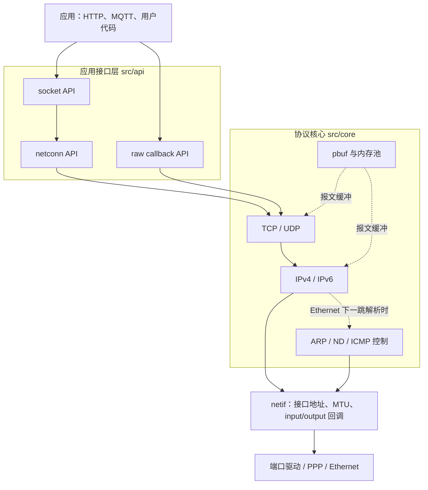

`struct netif` 是协议核心和网络接口实现之间的边界。它保存接口地址、MTU、硬件地址和回调。下面是根据 [`netif.h`](../src/include/lwip/netif.h#L166) 摘出的简化关系；[完整定义](../src/include/lwip/netif.h#L269)里还有 IPv6 地址、标志位、状态回调等字段：

```c
netif->input      // 驱动收到报文后交给 lwIP
netif->output     // IP 发 IPv4 包时调用；以太网常设为 etharp_output
netif->linkoutput // 以太网帧准备好后调用；由驱动真正发出
```

接收方向是 `input`；发送方向分两层：`output` 接收还带 IP 目的地址的包，可能需要先做下一跳解析；`linkoutput` 接收最终链路帧，驱动把它交给网卡。PPP 接口也通过 netif 集成，但它的输出回调会封装 PPP，而不是添加以太网 MAC 首部。

`pbuf`、`netif`、PCB 和内存池是后续读源码反复遇到的对象。下一章会分别说明它们的字段、分配来源和所有权关系。

#### 两种运行模型：裸机与 tcpip 线程

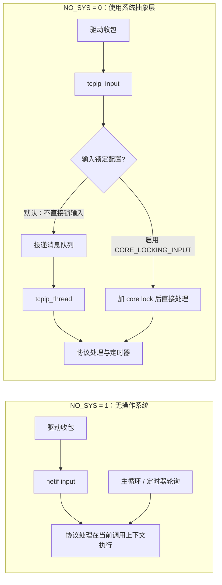

`NO_SYS=1` 没有 tcpip 线程、邮箱和信号量，只能使用 raw/callback 风格接口；应用还要保证协议栈不会被多个上下文同时调用。`NO_SYS=0` 时 [`tcpip_init()`](../src/api/tcpip.c#L659) 创建 tcpip 线程；[`tcpip_input()`](../src/api/tcpip.c#L297) 选择以太网或纯 IP 输入函数，并由 [`tcpip_inpkt()`](../src/api/tcpip.c#L254) 排队，或在启用核心互斥锁时直接处理。选项说明见 [`opt.h`](../src/include/lwip/opt.h#L81)。

常见 API 层次是：socket → netconn → raw。socket/netconn 适合线程式程序；raw API 把接收、发送完成等事件交给回调，控制更细、开销更低。核心 API 的具体启用方式由 `lwipopts.h` 等配置决定；可从 [`sockets.c`](../src/api/sockets.c)、[`api_msg.c`](../src/api/api_msg.c) 和 [`tcp.h` raw API 声明](../src/include/lwip/tcp.h#L410) 开始。

## 3. 内存管理与核心数据结构

lwIP 面向内存受限设备，理解协议行为时必须同时理解“对象从哪里分配、由谁持有、何时释放”。读任何报文路径，都可以沿着**分配 → 传递/排队 → 引用计数变化 → 释放**追踪。

### 3.1 `mem` 与 `memp`：两类分配器

| 分配器 | 适合分配什么 | 常见接口 | 主要配置 |
| --- | --- | --- | --- |
| `mem` | 大小不固定的内存块，例如 `PBUF_RAM` 的报文空间 | `mem_malloc()` / `mem_free()` | `MEM_SIZE`；也可由 `MEM_LIBC_MALLOC`、`MEM_CUSTOM_ALLOCATOR` 或 `MEM_USE_POOLS` 改变实现 |
| `memp` | 类型和大小已知的协议对象，例如 TCP PCB、TCP 段、netconn、pbuf pool | `memp_malloc()` / `memp_free()` | `MEMP_NUM_TCP_PCB`、`MEMP_NUM_TCP_SEG`、`MEMP_NUM_NETCONN`、`PBUF_POOL_SIZE` 等 |

默认 `mem` 使用 lwIP 自己管理的堆；默认 `memp` 为常用对象建立固定大小的类型池。固定池能让容量和分配时间更可控，但池耗尽时同样会分配失败。配置 `MEMP_MEM_MALLOC` 后，`memp` 对象也可以改由 `mem` 提供。判断实际项目的行为时，以 `lwipopts.h` 覆盖值和编译宏为准。源码入口：[mem.c](../src/core/mem.c)、[memp.c](../src/core/memp.c)、[配置默认值](../src/include/lwip/opt.h#L246)。

资源规划要把对象数量与报文缓存一起看：并发 TCP 连接会占用 TCP PCB；未确认/待发送数据会占用 TCP 段和报文内存；接收突发则会消耗 pbuf pool。`MEMP_NUM_TCP_PCB` 足够，不代表 `PBUF_POOL_SIZE` 或 `MEM_SIZE` 也足够。池耗尽通常表现为 `NULL`、`ERR_MEM`、丢包或连接无法继续推进，可结合 [`memp_malloc()`](../src/core/memp.c#L337)、[`mem_malloc()`](../src/core/mem.c#L818) 和统计配置排查。

### 3.2 `pbuf`：报文缓冲、链表与所有权

`struct pbuf` 是 lwIP 各层共享的报文容器。它既描述数据，也记录链表关系、长度和引用计数：

| 字段 | 含义 |
| --- | --- |
| `payload` | 当前 pbuf 的数据起始地址 |
| `len` | 当前 pbuf 节点的数据长度 |
| `tot_len` | 当前节点及同一报文后续 pbuf 链的累计长度 |
| `next` | 链中的下一个 pbuf 节点 |
| `ref` | 当前 pbuf 被多少个所有者/链指针引用 |
| `type_internal` / `flags` | 分配来源、是否可变、RX/TX 用途等信息 |

下面是 [`struct pbuf`](../src/include/lwip/pbuf.h#L185) 的源码摘录。它是报文数据的描述符；大报文可以由多个这样的节点组成：

```c
struct pbuf {
  struct pbuf *next;       /* 同一报文中的下一个 pbuf */
  void *payload;           /* 当前节点数据起始地址 */
  u16_t tot_len;           /* 当前节点及后续链节点的累计长度 */
  u16_t len;               /* 当前节点的数据长度 */
  u8_t type_internal;      /* 类型与分配来源 */
  u8_t flags;              /* 报文标记 */
  LWIP_PBUF_REF_T ref;     /* 引用计数 */
  u8_t if_idx;             /* 接收接口索引 */
  LWIP_PBUF_CUSTOM_DATA    /* 可选的用户自定义字段 */
};
```

这是结构字段摘录，`LWIP_PBUF_CUSTOM_DATA` 等宏和配置字段由编译选项决定；完整定义与每个宏见 [`pbuf.h`](../src/include/lwip/pbuf.h#L185)。

一份逻辑报文可能由多个 pbuf 节点组成（例如驱动的 scatter/gather 接收）；`next` 是报文缓冲链，不表示收到多个独立 IP 包。TCP 的 `unsent`、`unacked`、`ooseq` 则是协议队列，队列节点通常是 `tcp_seg`，它们与 pbuf 链是两种不同结构。

| pbuf 类型 | 数据放在哪里 | 常见用途与注意事项 |
| --- | --- | --- |
| `PBUF_RAM` | lwIP 堆中的连续可写内存 | 常用于构造待发送报文；pbuf 头部和数据一起分配 |
| `PBUF_POOL` | 固定大小的 pbuf pool，可链成一份大报文 | 常用于接收；一般不要拿它长期排队发送，否则 pool 被占满时可能连 TCP ACK 都收不到 |
| `PBUF_ROM` | pbuf 描述符引用不可变的外部数据 | 适合静态常量数据；协议头通常需要另行添加/链接 |
| `PBUF_REF` | pbuf 描述符引用外部 RAM 数据 | 适合短期引用；若数据会排队且外部内容可能改变，必须确保其生命周期/复制策略正确 |

`pbuf_layer` 与 `pbuf_type` 是两个不同参数：前者指定为后续协议首部预留多少头部空间，后者指定数据和描述符的分配/引用方式。`PBUF_TRANSPORT`、`PBUF_IP`、`PBUF_LINK`、`PBUF_RAW` 都是头部预留层级，不代表 RAM 或 pool 类型。完整字段和类型说明见 [`pbuf.h`](../src/include/lwip/pbuf.h#L138)；分配、引用和释放入口分别是 [`pbuf_alloc()`](../src/core/pbuf.c#L226)、[`pbuf_ref()`](../src/core/pbuf.c#L833) 和 [`pbuf_free()`](../src/core/pbuf.c#L729)。

引用计数规则是：新增一个独立所有者时增加引用；当前所有者不再访问时释放自己的引用。引用降到零后，lwIP 才回收对应存储。驱动接收后的典型所有权转移如下；若 `netif->input()` 返回 `ERR_OK`，报文已交给协议栈，驱动不再释放；输入函数返回错误时，调用者仍要释放：

```c
struct pbuf *p = pbuf_alloc(PBUF_RAW, frame_len, PBUF_POOL);
if (p == NULL) {
  return;                         /* pool 耗尽：丢弃或计数 */
}

read_frame_into_pbuf(p);          /* 示例：把网卡帧写入 pbuf */
if (netif->input(p, netif) != ERR_OK) {
  pbuf_free(p);                   /* 未被协议栈接收，驱动仍负责释放 */
}
/* ERR_OK：所有权已转给 lwIP，不要再次访问或释放 p */
```

零拷贝驱动可以把 DMA 缓冲区包装成 custom pbuf，并在最后一个引用释放时归还 DMA 描述符；这要求自定义释放回调、缓存一致性和缓冲区生命周期都正确。TCP 可能为了重传长期持有发送数据，因此“函数已经返回”不等于底层缓冲区可以立即复用。

### 3.3 `netif`：协议栈与网卡/链路的边界

`struct netif` 表示一个逻辑网络接口。它可以代表以太网、PPP、SLIP 或其他链路；不等同于物理网卡结构。驱动私有数据通常放在 `netif->state`，协议核心通过回调和接口属性与驱动交互。

| 成员/回调 | 方向 | 作用 |
| --- | --- | --- |
| `input` | 驱动 → lwIP | 驱动收到 pbuf 后调用的入口；`NO_SYS=0` 常设为 `tcpip_input()`，由 tcpip 线程处理 |
| `output` | IPv4 → 链路适配 | 接收已带 IPv4 首部的包及下一跳 IP；以太网通常走 `etharp_output()`，PPP 使用自己的输出回调 |
| `output_ip6` | IPv6 → 链路适配 | 接收 IPv6 包及下一跳；以太网通常经 IPv6 邻居发现解析链路地址 |
| `linkoutput` | lwIP → 驱动 | 发送已经形成链路帧的数据；以太网驱动在这里提交 MAC/DMA |
| `state` | 双向 | 驱动私有状态，例如 MAC/DMA 句柄、收发队列上下文 |
| `mtu`、`hwaddr`、`flags`、IP 地址 | 配置/状态 | 描述最大传输单元、链路地址、能力标志、IPv4/IPv6 地址等 |

把 [`struct netif`](../src/include/lwip/netif.h#L269) 缩写成代码，可以看到它保存地址配置，并把协议核心接到驱动回调上：

```c
struct netif {
#if !LWIP_SINGLE_NETIF
  struct netif *next;       /* 多接口配置下的接口链表 */
#endif
#if LWIP_IPV4
  ip_addr_t ip_addr, netmask, gw;
#endif
#if LWIP_IPV6
  ip_addr_t ip6_addr[LWIP_IPV6_NUM_ADDRESSES];
#endif
  netif_input_fn input;     /* 驱动收到报文后交给 lwIP */
#if LWIP_IPV4
  netif_output_fn output;   /* IPv4 输出：通常先解析下一跳 */
#endif
  netif_linkoutput_fn linkoutput; /* 最终链路发送 */
#if LWIP_IPV6
  netif_output_ip6_fn output_ip6;
#endif
  void *state;              /* 驱动私有状态 */
  u16_t mtu;
  u8_t hwaddr[NETIF_MAX_HWADDR_LEN];
  u8_t hwaddr_len, flags;
  char name[2];
  u8_t num;
  /* 状态回调、统计、多播过滤器等可选字段略 */
};
```

这是便于学习的字段摘录，实际定义包含更多由宏控制的成员。驱动一般填写硬件地址、MTU、能力标志和回调；完整定义见 [`netif.h`](../src/include/lwip/netif.h#L269)。

最重要的边界是：`output` 仍能看到网络层的下一跳地址；`linkoutput` 收到的是最终链路层数据。以太网的典型发送路径是 `ip4_output()` → `netif->output`（ARP 解析）→ `ethernet_output()` → `netif->linkoutput`。PPP 不生成以太网帧，因此其输出回调不同。

接口生命周期也有两个独立状态：`netif_set_up()` 表示软件/管理层启用接口；`netif_set_link_up()` 表示底层载波或链路当前可用。以太网线未插好时，接口可以处于“管理状态已启用、物理链路未连接”的状态。接口登记和状态切换入口见 [`netif_add()`](../src/core/netif.c#L287)、[`netif_set_up()`](../src/core/netif.c#L873)、[`netif_set_link_up()`](../src/core/netif.c#L1020)；结构字段见 [`netif.h`](../src/include/lwip/netif.h#L269)。

### 3.4 PCB 与报文队列：协议状态放在哪里

PCB（Protocol Control Block）是 lwIP 保存协议端点状态的控制块。应用接口把操作关联到相应 PCB；IP/链路层根据 PCB 和 pbuf 队列继续收发。

| 数据结构 | 保存什么 | 典型关系 |
| --- | --- | --- |
| `tcp_pcb` | 本地/远端 IP 与端口、TCP 状态、序号、窗口、定时器、回调 | 一条 TCP 连接对应一个活动 PCB；监听 PCB 另有监听结构 |
| `udp_pcb` | UDP 本地/远端地址、端口和接收回调 | UDP 无 TCP 式连接状态机，可按端口/地址匹配 datagram |
| `raw_pcb` | IP 协议号、地址条件和回调 | 应用可接触指定 IP 协议载荷 |
| `tcp_seg` | 一个 TCP 段及其首部、pbuf 数据引用和队列链接 | `unsent`、`unacked`、`ooseq` 是 TCP 管理的发送/接收队列 |
| ARP / ND cache | IP 下一跳与链路层地址、邻居状态 | IP 选择接口后，链路输出使用缓存或发起解析 |

#### TCP、UDP 控制块和 TCP 段的 C 摘录

TCP 把“连接状态”和“报文段”分开保存。下面从 [`tcp_pcb`](../src/include/lwip/tcp.h#L242) 摘出与连接、窗口和重传最相关的字段：

```c
struct tcp_pcb {
  IP_PCB;                         /* 本地/远端 IP 等公共字段 */
  TCP_PCB_COMMON(struct tcp_pcb); /* TCP 公共状态与端口等 */
  u16_t remote_port;
  tcpflags_t flags;

  u32_t rcv_nxt;                  /* 下一个期望收到的序号 */
  tcpwnd_size_t rcv_wnd;          /* 本机接收窗口 */
  s16_t rtime;                    /* 重传计时器 */
  u16_t mss;
  s16_t rto;
  u8_t nrtx, dupacks;
  u32_t lastack;
  tcpwnd_size_t cwnd, ssthresh;   /* 拥塞窗口与慢启动阈值 */
  u32_t snd_nxt;
  tcpwnd_size_t snd_wnd, snd_buf; /* 对端通告窗口、可用发送缓存 */

  struct tcp_seg *unsent;         /* 已排队但尚未发出的段 */
  struct tcp_seg *unacked;        /* 已发出、尚未确认的段 */
#if TCP_QUEUE_OOSEQ
  struct tcp_seg *ooseq;          /* 接收乱序段 */
#endif
  struct pbuf *refused_data;
  /* raw API 回调、keepalive、时间戳等条件字段略 */
};
```

`IP_PCB` 和 `TCP_PCB_COMMON` 是宏，会展开成更多共享字段；上面省略了可选配置成员，不是可替换源码的完整 ABI。要跟踪握手、窗口、重传和乱序队列，先看 `state`、`snd_nxt`、`rcv_nxt`、`snd_wnd`、`rcv_wnd`、`cwnd`、`unsent`、`unacked`、`ooseq`。完整定义见 [`tcp.h`](../src/include/lwip/tcp.h#L242)。

[`tcp_seg`](../src/include/lwip/priv/tcp_priv.h#L250) 是 TCP 队列节点，引用保存 TCP 首部和载荷的 pbuf：

```c
struct tcp_seg {
  struct tcp_seg *next;   /* 队列中的下一个 TCP 段 */
  struct pbuf *p;         /* TCP 首部和数据所在的 pbuf 链 */
  u16_t len;              /* TCP 序号空间长度 */
  u8_t flags;             /* SYN/MSS/时间戳等标志 */
  struct tcp_hdr *tcphdr; /* 指向 pbuf 中的 TCP 首部 */
};
```

实际定义还可能有校验和与调试字段。`tcp_pcb->unsent/unacked/ooseq` 指向 `tcp_seg` 队列，而 `tcp_seg->p` 指向承载数据的 pbuf；这就是“状态对象—队列节点—报文缓冲”三层关系。

#### UDP PCB、Netconn 与 Socket 的 C 摘录

UDP 没有 TCP 式连接状态机；[`udp_pcb`](../src/include/lwip/udp.h#L80) 主要保存 IP 公共配置、端口和接收回调：

```c
struct udp_pcb {
  IP_PCB;
  struct udp_pcb *next;
  u8_t flags;
  u16_t local_port, remote_port;
  udp_recv_fn recv;
  void *recv_arg;
};
```

线程式 API 再用 [`netconn`](../src/include/lwip/api.h#L218) 包住 PCB，并提供收包邮箱、accept 邮箱和完成信号量：

```c
struct netconn {
  enum netconn_type type;
  enum netconn_state state;
  union {
    struct ip_pcb *ip;
    struct tcp_pcb *tcp;
    struct udp_pcb *udp;
    struct raw_pcb *raw;
  } pcb;
  err_t pending_err;
#if !LWIP_NETCONN_SEM_PER_THREAD
  sys_sem_t op_completed;  /* 用于等待 core 操作完成 */
#endif
  sys_mbox_t recvmbox;     /* 接收数据交给应用任务 */
#if LWIP_TCP
  sys_mbox_t acceptmbox;   /* TCP 监听连接队列 */
#endif
  netconn_callback callback;
};
```

Socket 层的 [`lwip_sock`](../src/include/lwip/priv/sockets_priv.h#L67) 再把应用 fd 映射到一个 netconn：

```c
struct lwip_sock {
  struct netconn *conn;           /* 一个 socket 对应一个 netconn */
  union lwip_sock_lastdata lastdata; /* 上次读取剩余的数据 */
#if LWIP_SOCKET_SELECT || LWIP_SOCKET_POLL
  s16_t rcvevent;                 /* 接收就绪事件计数 */
  u16_t sendevent;                /* 发送就绪标志 */
  u16_t errevent;                 /* 错误事件标志 */
  SELWAIT_T select_waiting;       /* 正在等待该 socket 的任务数 */
#endif
#if LWIP_NETCONN_FULLDUPLEX
  u8_t fd_used;                   /* 正在使用该 lwip_sock 的引用数 */
  u8_t fd_free_pending;           /* 延迟释放状态/标志 */
#endif
};
```

上面保留了与 socket 事件通知和并发关闭直接相关的条件字段；完整定义见 [`sockets_priv.h`](../src/include/lwip/priv/sockets_priv.h#L67)。`rcvevent`、`sendevent`、`errevent` 和 `select_waiting` 只在启用 `select` 或 `poll` 时编译；`fd_used`、`fd_free_pending` 只在启用 `LWIP_NETCONN_FULLDUPLEX` 时编译。`lastdata` 保存一次读取未消费完的数据，避免把“socket 可读”误解为数据一定还在接收邮箱里。

### `select/poll` 状态字段：把协议事件变成应用可等待的就绪通知

`select()` 和 `poll()` 是 socket 的 **I/O 多路复用**接口：一个任务可以同时等待多个 socket，而不用为每个连接都单独阻塞在 `recv()` 上。它们只报告“现在值得尝试读/写/处理错误”，不会替应用搬运数据，也不会保证一次 `send()` 写完全部内容。

| 字段 | 谁更新 | 用途与理解方式 |
| --- | --- | --- |
| `rcvevent` | [`event_callback()`](../src/api/sockets.c#L2524) 收到 `NETCONN_EVT_RCVPLUS/RCVMINUS` 时增减 | 接收就绪事件计数，不是字节数。`select/poll` 还会检查 `lastdata` 是否有上次读取留下的内容。 |
| `sendevent` | 收到 `NETCONN_EVT_SENDPLUS/SENDMINUS` 时置 1/清 0 | 代表本地发送侧当前允许尝试写入（TCP 中通常对应发送缓冲资源可用）；不代表数据已到达对端，更不代表对端应用已处理。 |
| `errevent` | 收到 `NETCONN_EVT_ERROR` 时置位 | 提醒等待方检查错误或连接状态。lwIP 当前把它映射到 `select()` 的 `exceptset` 和 `poll()` 的 `POLLERR`；这里的 `exceptset` 不应被当成带外数据接口。 |
| `select_waiting` | `lwip_select()` / `lwip_poll()` 入睡前增加，离开等待时减少 | 当前等待这个 socket 的多路复用调用数。协议事件到来时，lwIP 据此决定是否需要扫描等待者并唤醒任务。 |

两种 API 共用 `sockets.c` 中的事件回调和等待者链表。接收、发送空间变化或错误事件先更新这些状态，再发信号量唤醒任务；任务醒来后重新扫描 socket，确认哪些 fd 真的就绪。因此“被唤醒”只是重新检查的提示，应用仍要查看返回的 fd/事件位。

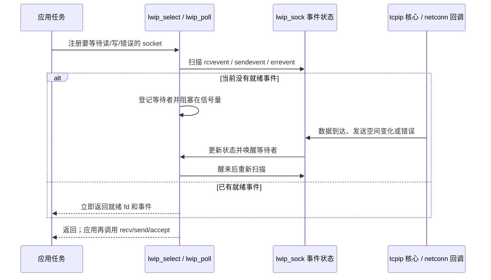

源码中 [`lwip_select()`](../src/api/sockets.c#L2004) 将 `fd_set` 转成就绪集合；[`lwip_poll()`](../src/api/sockets.c#L2366) 遍历 `pollfd` 数组并填写 `revents`；两者最终由 [`event_callback()`](../src/api/sockets.c#L2524) 驱动唤醒。`LWIP_SOCKET_SELECT` 和 `LWIP_SOCKET_POLL` 在 [`opt.h`](../src/include/lwip/opt.h#L2162) 中默认开启，但产品配置可以关闭其中之一。

### 并发关闭状态字段：防止正在运行的 socket 操作访问已释放对象

`fd_used` 不是“整数 fd 被应用引用了几次”，而是源码注释所说的：当前有多少个任务正在使用对应的 `struct lwip_sock`。`fd_free_pending` 则记录关闭已经开始、对象需要延迟释放。它们解决的是对象生命周期问题：例如一个任务阻塞在读、另一个任务正在写、第三个任务调用 `close()` 时，不能立刻释放 `lwip_sock`、`netconn` 和残留报文，否则仍在执行的代码会访问已释放内存。

启用 [`LWIP_NETCONN_FULLDUPLEX`](../src/include/lwip/opt.h#L2002) 后，关键过程如下：

1. socket 操作通过 `get_socket()` / `tryget_socket()` 取得 socket，并增加 `fd_used`；操作结束时调用 [`done_socket()`](../src/api/sockets.c#L416) 归还引用。
2. [`lwip_close()`](../src/api/sockets.c#L812) 先调用 [`netconn_prepare_delete()`](../src/api/api_lib.c#L192) 关闭 netconn，再由 [`free_socket_locked()`](../src/api/sockets.c#L587) 释放 socket 表项。
3. 如果还有其他任务持有引用，`free_socket_locked()` 不立即清空对象，而是设置 `fd_free_pending`。这个状态也阻止新操作再取得该 socket。
4. 已经运行的操作各自结束并调用 `done_socket()`；最后一个引用归还时，才释放 `lwip_sock` 持有的残留 pbuf/netbuf 和 netconn。只有到这个阶段，socket 槽位才可安全复用。

`fd_free_pending` 使用源码中的位标志：`LWIP_SOCK_FD_FREE_FREE` 表示延迟释放，`LWIP_SOCK_FD_FREE_TCP` 表示这是 TCP socket，供最终释放时按 TCP/UDP 类型清理 `lastdata` 联合体。它们是 lwIP 内部状态，应用程序不应直接读写。

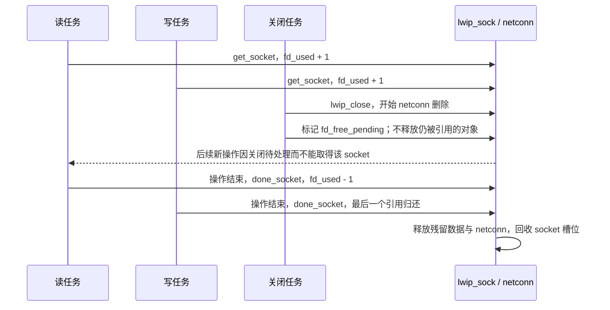

这个保护仅在 [`LWIP_NETCONN_FULLDUPLEX`](../src/include/lwip/opt.h#L2002) 编译开启时存在；该配置要求同时设置 `LWIP_NETCONN_SEM_PER_THREAD=1`。每个会调用 socket/netconn API 的 RTOS 任务应在任务入口调用 [`lwip_socket_thread_init()`](../src/api/sockets.c#L359)，退出前调用 [`lwip_socket_thread_cleanup()`](../src/api/sockets.c#L366)，让阻塞 API 使用各自线程的信号量。若未启用 full-duplex，不要让多个任务同时操作同一个 socket；由应用互斥保护，或让一个任务独占 socket。

应用层对象、协议状态、数据缓冲和链路接口之间的关系可以简化为：

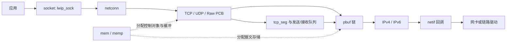

关键定义可从 [`tcp_pcb`](../src/include/lwip/tcp.h#L242)、[`pbuf`](../src/include/lwip/pbuf.h#L186)、[`netif`](../src/include/lwip/netif.h#L269) 以及 [`memp_std.h`](../src/include/lwip/priv/memp_std.h) 开始。读一个连接时，建议分别追踪“连接状态 PCB”“报文内容 pbuf”“TCP 队列节点 tcp_seg”，不要把它们当成同一个对象。

## 4. 一份报文从哪里来、又到哪里去

### 收包：从网卡向上交给应用

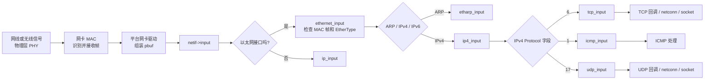

如果使用 `NO_SYS=0`，驱动通常把包交给 [`tcpip_input()`](../src/api/tcpip.c#L297)，它会把处理任务送到 tcpip 线程；[`tcpip_inpkt()`](../src/api/tcpip.c#L254) 展示了排队/加锁的入口。如果使用无操作系统模式，包也可以直接经 [`netif_input()`](../src/core/netif.c#L228) 进入协议栈。两种模式的共同点是：**网卡驱动把收到的数据交给 lwIP，之后才开始协议解析。**

对于以太网接口，[`ethernet_input()`](../src/netif/ethernet.c#L170) 读取帧中的 EtherType：IPv4 帧去 `ip4_input()`，ARP 帧去 `etharp_input()`。IPv4 层再根据 IP 头的 Protocol 字段把载荷交给 TCP、ICMP 或 UDP，见 [`ip4_input()`](../src/core/ipv4/ip4.c#L712)。

### 发包：从应用向网卡发送


这条路径可从 [`tcp_write()`](../src/core/tcp_out.c#L393) → [`tcp_output()`](../src/core/tcp_out.c#L1241) → [`tcp_output_segment()`](../src/core/tcp_out.c#L1459) → [`ip4_output()`](../src/core/ipv4/ip4.c#L1072) → [`etharp_output()`](../src/core/ipv4/etharp.c#L792) → [`ethernet_output()`](../src/netif/ethernet.c#L270) 顺着读。实际接口回调由具体 netif 初始化代码配置；以太网驱动的最终发送回调是 `netif->linkoutput`。

若 ARP 缓存里还没有下一跳的 MAC 地址，IPv4 数据包会暂存在 ARP 队列中，lwIP 先发 ARP 请求；收到 ARP 应答、学到 MAC 地址后，再发送排队的数据包。相关逻辑在 [`etharp_query()`](../src/core/ipv4/etharp.c#L934) 和 [`etharp_input()`](../src/core/ipv4/etharp.c#L642)。

### 代码调用链：ARP、IP、TCP 与 UDP

下面按 Ethernet + IPv4 网卡展示当前仓库的主要调用链。真实执行会受 `NO_SYS`、`LWIP_*` 配置、所选 API 和网卡类型影响；先记住每个协议的入口和向下一层的出口，再跟着链接读条件分支。

#### 四种协议首部的 C 结构

这些结构把线上报文的字段映射到 C 成员。以下省略了源码中的 `PACK_STRUCT_*` 包装宏，方便阅读字段顺序；lwIP 用这些宏处理不同编译器的打包和对齐，完整定义可点击查看。

```c
/* ARP：硬件类型/协议类型、地址长度、操作码和两端地址 */
struct etharp_hdr {
  u16_t hwtype, proto;
  u8_t hwlen, protolen;
  u16_t opcode;
  struct eth_addr shwaddr;
  struct ip4_addr_wordaligned sipaddr;
  struct eth_addr dhwaddr;
  struct ip4_addr_wordaligned dipaddr;
};

/* IPv4：固定字段；options（如果有）跟在这个固定头之后 */
struct ip_hdr {
  u8_t _v_hl, _tos;
  u16_t _len, _id, _offset;
  u8_t _ttl, _proto;
  u16_t _chksum;
  ip4_addr_p_t src, dest;
};

/* TCP：控制位与数据偏移编码在 _hdrlen_rsvd_flags 中 */
struct tcp_hdr {
  u16_t src, dest;
  u32_t seqno, ackno;
  u16_t _hdrlen_rsvd_flags;
  u16_t wnd, chksum, urgp;
};

/* UDP：首部固定为 8 字节 */
struct udp_hdr {
  u16_t src, dest;
  u16_t len, chksum;
};
```

完整源码定义分别见 [`etharp_hdr`](../src/include/lwip/prot/etharp.h#L86)、[`ip_hdr`](../src/include/lwip/prot/ip4.h#L79)、[`tcp_hdr`](../src/include/lwip/prot/tcp.h#L56) 和 [`udp_hdr`](../src/include/lwip/prot/udp.h#L53)。字段在报文中按网络字节序传输；访问和修改时应使用 lwIP 的首部宏与字节序函数，不能把线上字节直接当作本机整数处理。

| 协议/方向 | 主要函数调用链 | 这条链在做什么 |
| --- | --- | --- |
| ARP 收包 | [`ethernet_input()`](../src/netif/ethernet.c#L190) → [`etharp_input()`](../src/core/ipv4/etharp.c#L642) → [`etharp_update_arp_entry()`](../src/core/ipv4/etharp.c#L423)；若请求的是本机 IP，则 [`etharp_raw()`](../src/core/ipv4/etharp.c#L1110) → [`ethernet_output()`](../src/netif/ethernet.c#L270) → `netif->linkoutput` | 以太网按 EtherType 分给 ARP；ARP 检查报文并更新 IP→MAC 缓存。请求本机地址时生成 ARP Reply；ARP Reply 可能使等待该 MAC 的 IP 包继续发送。 |
| ARP 发包/解析下一跳 | [`ip4_output_if_opt_src()`](../src/core/ipv4/ip4.c#L874) → `netif->output`（以太网通常设置为）[`etharp_output()`](../src/core/ipv4/etharp.c#L792) → 命中缓存时 [`etharp_output_to_arp_index()`](../src/core/ipv4/etharp.c#L749) → `ethernet_output()`；未命中时 [`etharp_query()`](../src/core/ipv4/etharp.c#L934) → [`etharp_request()`](../src/core/ipv4/etharp.c#L1207) → [`etharp_raw()`](../src/core/ipv4/etharp.c#L1110) → `ethernet_output(ETHTYPE_ARP)` | IP 层给出下一跳 IP；ARP 决定目的 MAC。缓存缺失时先广播请求并排队待发 IP 包。异网目的地址会解析网关 IP，而不是远端主机 IP。 |
| IPv4 收包 | [`ethernet_input()`](../src/netif/ethernet.c#L173) → [`ip4_input()`](../src/core/ipv4/ip4.c#L460) → 校验/本机接收或转发/可选重组 → 按 Protocol 分发到 [`tcp_input()`](../src/core/tcp_in.c#L118)、[`udp_input()`](../src/core/udp.c#L194) 或 [`icmp_input()`](../src/core/ipv4/icmp.c#L80) | 以太网先按 EtherType 找到 IPv4；IPv4 再按 Protocol 字段找传输层/控制协议。 |
| IPv4 发包 | 通用路径：[`ip4_output()`](../src/core/ipv4/ip4.c#L1072) → [`ip4_route_src()`](../src/core/ipv4/ip4.c#L129) → [`ip4_output_if()`](../src/core/ipv4/ip4.c#L821) → [`ip4_output_if_opt_src()`](../src/core/ipv4/ip4.c#L874) → `netif->output` | 选接口、补 IPv4 首部和校验和，再交给链路适配。TCP/UDP 通常已选定 netif，直接走 `ip_output_if()`/`ip_output_if_src()` 到 IPv4 输出，所以调用栈不一定经过通用的 `ip4_output()` 选路入口。 |
| TCP 收包 | IPv4 分发 → [`tcp_input()`](../src/core/tcp_in.c#L118) → 查找连接/监听 PCB → [`tcp_process()`](../src/core/tcp_in.c#L791) → [`tcp_receive()`](../src/core/tcp_in.c#L1154) 整理数据/ACK → 返回 `tcp_input()` 触发 [`TCP_EVENT_RECV`](../src/core/tcp_in.c#L501) → raw 回调或 Netconn 的 [`recv_tcp()`](../src/api/api_msg.c#L296) → 接收邮箱 | TCP 根据四元组和状态处理 SYN/ACK/RST；已建立连接的数据路径还要检查序号、窗口、ACK，并处理按序/乱序数据。监听 SYN 会经过专门的 [`tcp_listen_input()`](../src/core/tcp_in.c#L630) 分支。 |
| TCP 发包 | raw：[`tcp_write()`](../src/core/tcp_out.c#L393) → [`tcp_output()`](../src/core/tcp_out.c#L1241) → [`tcp_output_segment()`](../src/core/tcp_out.c#L1459) → [`ip_output_if()`](../src/core/tcp_out.c#L1611) → IPv4/链路层；Socket：[`lwip_send()`](../src/api/sockets.c#L1422) → [`netconn_write_partly()`](../src/api/api_lib.c#L974) → [`lwip_netconn_do_write()`](../src/api/api_msg.c#L1817) → [`lwip_netconn_do_writemore()`](../src/api/api_msg.c#L1644) → `tcp_write()` / `tcp_output()` | `tcp_write()` 把数据放进 TCP 发送队列；`tcp_output()` 再依据发送窗口、拥塞窗口和 Nagle 条件决定发哪些段。数据进入 `unacked` 后等待 ACK。 |
| UDP 收包 | IPv4 分发 → [`udp_input()`](../src/core/udp.c#L194) → 按地址/端口查找 `udp_pcb`、校验并移除 UDP 首部 → [`pcb->recv(...)`](../src/core/udp.c#L402) → raw 回调，或 Netconn 的 [`recv_udp()`](../src/api/api_msg.c#L218) → 接收邮箱 | UDP 没有连接状态机；用本地地址/端口等匹配 PCB，再把一个数据报交给注册的接收回调。 |
| UDP 发包 | raw：[`udp_sendto()`](../src/core/udp.c#L520) → [`udp_sendto_if()`](../src/core/udp.c#L624) → [`udp_sendto_if_src()`](../src/core/udp.c#L699) → 填 UDP 首部/校验和 → [`ip_output_if_src()`](../src/core/udp.c#L893) → IPv4/链路层；Socket：[`lwip_sendto()`](../src/api/sockets.c#L1625) → [`netconn_send()`](../src/api/api_lib.c#L941) → [`lwip_netconn_do_send()`](../src/api/api_msg.c#L1536) → UDP 发送路径 | UDP 发送时添加端口、长度和校验和，然后把数据报交给 IP；不会为数据报等待对端确认。 |

ARP 表本身也有对应的数据结构。当前实现用固定大小的 [`arp_table`](../src/core/ipv4/etharp.c#L106) 保存状态；每一项记录待解析/已解析的 IP、MAC、所属接口和待发包：

```c
struct etharp_entry {
#if ARP_QUEUEING
  struct etharp_q_entry *q; /* 等待 ARP 解析完成的报文队列 */
#else
  struct pbuf *q;           /* 关闭队列时最多保存一个待发包 */
#endif
  ip4_addr_t ipaddr;
  struct netif *netif;
  struct eth_addr ethaddr;
  u16_t ctime;
  u8_t state;               /* EMPTY / PENDING / STABLE 等 */
};
```

真实实现见 [`etharp_entry`](../src/core/ipv4/etharp.c#L91)。ARP Reply 更新表项后，`etharp_update_arp_entry()` 会把排队的 IPv4 包交给 `ethernet_output()`；ARP 请求本身则通过 `etharp_raw()` 直接发以太网广播帧。

整体关系可以先画成这样。注意图中把 `netif->output` 配置为 `etharp_output` 的情况作为以太网示例；PPP 等点到点接口不会走 ARP/Ethernet 这一段：

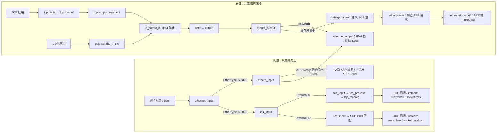

从图里记住三个边界：**ARP 是以太网帧类型分发出来的链路解析，不是 IPv4 Protocol 的一种；IPv4 负责把载荷分发给 TCP/UDP；TCP 和 UDP 的发包最终都要进入 IP，再由 netif 选择对应链路输出。**

Netconn/socket 的收包“最后一跳”也可以沿着回调读：TCP 在 [`setup_tcp()`](../src/api/api_msg.c#L517) 注册 [`recv_tcp()`](../src/api/api_msg.c#L296)，该回调把 pbuf 放入 `recvmbox`；Socket 的 [`lwip_recv_tcp()`](../src/api/sockets.c#L960) 再调用 [`netconn_recv_tcp_pbuf_flags()`](../src/api/api_lib.c#L803) 取数据。UDP 在 [`lwip_netconn_do_newconn()`](../src/api/api_msg.c#L683) 注册 [`recv_udp()`](../src/api/api_msg.c#L218)，回调把 pbuf 包成 netbuf 后投递到邮箱；Socket 的 [`lwip_recvfrom()`](../src/api/sockets.c#L1239) → [`lwip_recvfrom_udp_raw()`](../src/api/sockets.c#L1128) 路径通过 [`netconn_recv_udp_raw_netbuf_flags()`](../src/api/api_lib.c#L842) 取回来源地址、端口和数据。

## 5. 从物理层到传输层：每层解决什么问题

| 层次 | 主要问题 | 常见地址或字段 | lwIP 中要看的部分 |
| --- | --- | --- | --- |
| 物理层 | 如何把 0/1 变成电信号、光信号或无线信号 | 介质、速率、PHY 状态 | 通常由芯片和平台驱动处理 |
| 链路层（以太网） | 如何把数据送到同一条链路上的下一个设备 | 源/目的 MAC、EtherType | [`ethernet_input()`](../src/netif/ethernet.c#L81)、[`ethernet_output()`](../src/netif/ethernet.c#L270) |
| 网络层（IP） | 如何跨多个网络把包送到目标 IP | 源/目的 IP、TTL、Protocol | [`ip4_input()`](../src/core/ipv4/ip4.c#L460)、[`ip4_output()`](../src/core/ipv4/ip4.c#L1072) |
| 传输层（TCP/UDP） | 如何在两台主机上的应用端点之间传数据 | 端口；TCP 还有序号、确认号和窗口 | [`tcp_input()`](../src/core/tcp_in.c#L118)、[`tcp_output()`](../src/core/tcp_out.c#L1241) |

一个普通 TCP/IPv4/以太网包可以这样看：

```text
以太网帧：目的 MAC | 源 MAC | EtherType=IPv4 | IPv4 数据报 | FCS
IPv4 数据报：源 IP | 目的 IP | Protocol=TCP(6) | TTL | TCP 段
TCP 段：源端口 | 目的端口 | Seq | Ack | 标志位 | Window | 应用数据
```

这是逐层封装：发送时外层一层层加首部，接收时反向拆开。以太网帧的 FCS 常由网卡硬件生成或剥离，所以驱动交给 lwIP 的 `pbuf` 不一定包含 FCS。

要牢记地址的作用范围：**MAC 地址用于当前链路的一跳；IP 地址标识跨网络的目标；TCP 端口标识目标主机上的应用端点。** 路由器转发时，外层链路帧会换成下一段链路需要的帧；IP 包仍以最终目标为目的地（TTL 等字段会变化）。

## 6. ARP：IPv4 地址怎样找到以太网 MAC 地址

ARP（Address Resolution Protocol）解决的是：**在 IPv4 以太网中，给定下一跳的 IPv4 地址，怎样找到它的 MAC 地址？** ARP 请求本身直接放在以太网帧里，并不封装在 IPv4 包内。

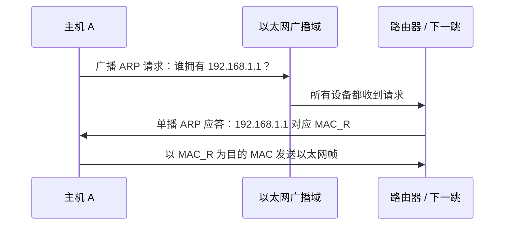

假设主机 A 要访问 `203.0.113.9`，但它自己的网段是 `192.168.1.0/24`：

1. IP 层仍把 IP 目的地址写成 `203.0.113.9`。
2. 由于目标不在本地子网，链路层要找的是默认网关的 MAC，而不是 `203.0.113.9` 对应设备的 MAC。
3. 以太网帧目的 MAC 填路由器 MAC。路由器之后再转发到下一跳。

[`etharp_output()`](../src/core/ipv4/etharp.c#L803) 会比较目标 IP 与接口的本地网段；目标在异网时，它选择网关 IP，再用 ARP 表找相应 MAC。ARP 请求/应答的输入处理和缓存更新可看 [`etharp_input()`](../src/core/ipv4/etharp.c#L697)。

#### ARP 的收发状态与关键代码

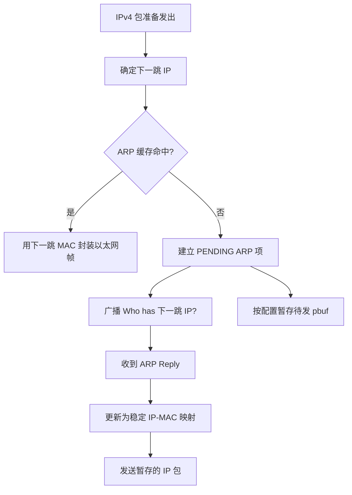

下面是 [`etharp_output()`](../src/core/ipv4/etharp.c#L792) 中“异网时解析网关”的简化逻辑。省略了广播、多播、缓存提示和路由 hook：

```c
/* 目的主机不在本地子网时，二层下一跳是默认网关。 */
if (!ip4_addr_net_eq(ipaddr, netif_ip4_addr(netif),
                     netif_ip4_netmask(netif))) {
  dst_addr = netif_ip4_gw(netif);
}

/* dst_addr 是要解析 MAC 的下一跳 IP；q 仍是原来的 IP 包。 */
return etharp_query(netif, dst_addr, q);
```

`etharp_query()` 会查找或建立 ARP 表项，发送请求并处理待发包；代码入口是 [`etharp_query()`](../src/core/ipv4/etharp.c#L934)。收到 ARP 包时，lwIP先用对方的发送方 IP/MAC 更新缓存；如果请求的目标 IP 是本机，就回 ARP Reply，见 [`etharp_input()`](../src/core/ipv4/etharp.c#L697)。

**关键理解：**ARP 查询的目标可能是网关，而 IPv4 首部里的目的 IP 仍是远端服务器。只有每一跳的以太网目的 MAC 在路由器之间改变。

ARP 只解决本地以太网链路上的 IPv4 邻居解析。IPv6 不使用 ARP，而使用 Neighbor Discovery（ND），实现位于 [`src/core/ipv6/nd6.c`](../src/core/ipv6/nd6.c)。

## 7. PPP：点到点链路、串口 PPP 和 PPPoE

PPP（Point-to-Point Protocol，点到点协议）是链路层协议。它规定两端如何建立/协商链路，以及如何将 IPv4、IPv6 等网络层包封装到链路帧中；它不替代 IP/TCP。这里的“点到点”是指**一条逻辑链路只有两个端点**，不是说整个物理网络只能有两台设备。PPP 的标准定义见 [RFC 1661](https://www.rfc-editor.org/rfc/rfc1661.html)。

| 名称 | 它是什么 | 它主要解决什么问题 |
| --- | --- | --- |
| PPP | 点到点链路层协议核心 | 封装多种网络层协议；用 LCP 协商链路，用 NCP 配置对应的网络层协议 |
| PPPoS | PPP over Serial：PPP 通过串口承载 | UART 等串口本身提供字节流，没有天然的数据包边界；PPP 串行帧通过标志、转义和 FCS 划分/检查帧。lwIP 对应 [`pppos.c`](../src/netif/ppp/pppos.c#L174)；HDLC-like PPP framing 见 [RFC 1662](https://www.rfc-editor.org/rfc/rfc1662.html) |
| PPPoE | PPP over Ethernet：PPP 会话通过以太网承载 | 以太网可被多台设备共享；PPPoE 发现接入集中器并分配会话标识，为每个主机建立逻辑上的点到点 PPP 会话。会话定义见 [RFC 2516](https://www.rfc-editor.org/rfc/rfc2516.html) |

因此，**PPPoS/PPPoE 是 PPP 对不同底层链路的承载适配，不是 TCP/UDP 的替代品**。PPPoE 的 Ethernet 物理网络仍使用 MAC 地址；但 PPP 会话内部是点到点关系。路由器是这段 PPP 链路的直接对端，而不是 Internet 上每个远端 IP 主机。普通 PPP 链路不需要像共享 Ethernet LAN 那样用 ARP 查找对端 MAC。

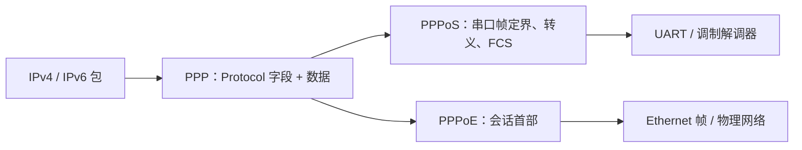

以 IPv4 为例，PPP Protocol `0x0021` 表示 PPP 帧内装的是 IPv4；IP 包中的 Protocol 字段再标明载荷是 TCP（`6`）、UDP（`17`）还是 ICMP（`1`）。这两个字段属于不同层，不能混为一谈。

| PPP 内部协议 | 作用 | 在 lwIP 中可先看 |
| --- | --- | --- |
| LCP | 协商链路参数、检测/终止链路 | [`lcp.c`](../src/netif/ppp/lcp.c#L361) |
| PAP / CHAP / EAP | 按配置验证对端身份；是认证协议，不等价于链路加密 | [`upap.c`](../src/netif/ppp/upap.c)、[`chap-new.c`](../src/netif/ppp/chap-new.c)、[`eap.c`](../src/netif/ppp/eap.c) |
| IPCP | 协商 IPv4 网络层参数，如本端/对端地址及选项 | [`ipcp.c`](../src/netif/ppp/ipcp.c#L590) |
| IPv6CP | 协商 PPP 链路上的 IPv6 参数 | [`ipv6cp.c`](../src/netif/ppp/ipv6cp.c) |

### PPP 链路建立过程

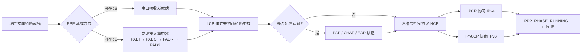

这张图中的 PPPoE 发现发生在 PPP 协商之前；PPPoS 没有这一步。进入 PPP 后，两端通常各自发送 LCP `Configure-Request`：对方接受则回 `Configure-Ack`；选项值不合适可回 `Configure-Nak` 并建议新值；不支持的选项可回 `Configure-Reject`。两端的请求都被确认、各自也确认了对端请求后，LCP 才进入 Opened。两方向可以交错协商，这不是 TCP 的三次握手。

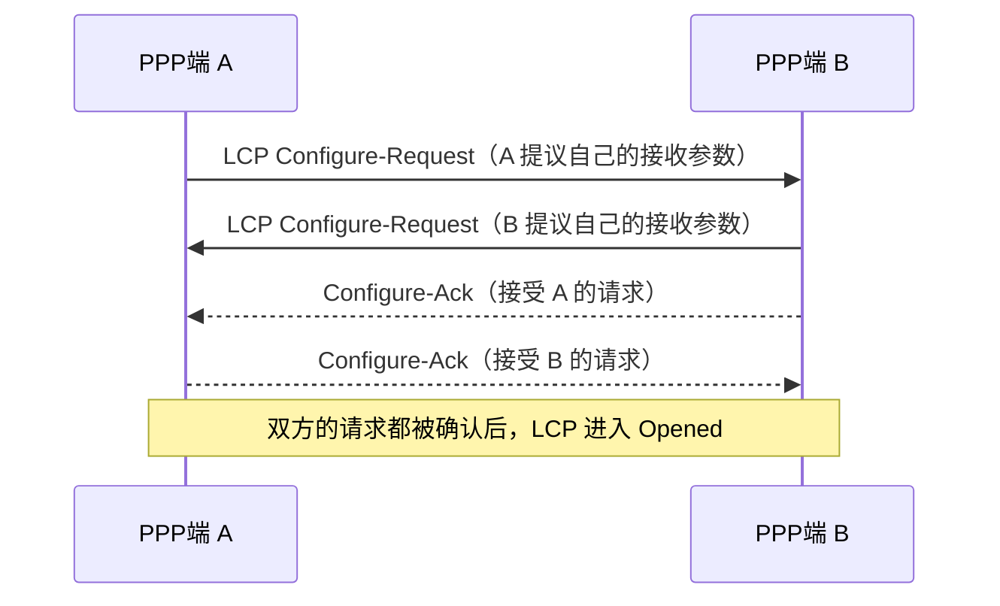

LCP 只协商与具体网络层无关的链路选项，不协商 IPv4 地址。需要认证时，在 LCP 协商之后执行；接着 IPCP/IPv6CP 分别配置 IPv4/IPv6。只有相应 NCP 打开，PPP 才开始承载该网络层的数据。相关 PPP Protocol 字段包括 LCP `0xC021`、IPCP `0x8021`、IPv4 `0x0021`、IPv6 `0x0057`。lwIP 的 PPP 阶段定义和说明在 [`ppp.h`](../src/include/netif/ppp/ppp.h#L116) 与 [`ppp_impl.h`](../src/include/netif/ppp/ppp_impl.h#L667)；连接入口在 [`ppp_connect()`](../src/netif/ppp/ppp.c#L275)，LCP 进入状态机见 [`lcp_open()`](../src/netif/ppp/lcp.c#L406)，通用 Configure-Request 在 [`fsm_sconfreq()`](../src/netif/ppp/fsm.c#L704)。认证不是必然发生，协议支持也受 `PPP_*_SUPPORT` 配置控制。

### PPPoS：串口字节如何变成 IP 包

PPP 串行帧使用类似 HDLC 的定界/转义和 FCS。`pppos_input()` 接收 UART 等驱动交来的字节，识别帧边界/转义，累计并校验 FCS；完整帧通过后交给 `ppp_input()`，见 [`pppos_input()`](../src/netif/ppp/pppos.c#L480) 以及校验/派发附近代码 [`pppos.c`](../src/netif/ppp/pppos.c#L517)。发送方向分两条入口：PPP 控制类报文走 [`pppos_write()`](../src/netif/ppp/pppos.c#L200)；IP 数据报走 [`pppos_netif_output()`](../src/netif/ppp/pppos.c#L254)。两者都使用 PPPoS 的 FCS/转义助手，最终通过 `output_cb` 把串行字节交给端口驱动。

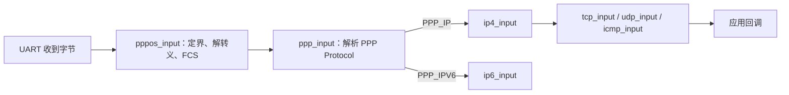

PPP 的 `Protocol` 字段把普通 IPv4 包分到 `ip4_input()`，IPv6 包分到 `ip6_input()`；代码在 [`ppp_input()`](../src/netif/ppp/ppp.c#L883)。从这里开始，后续 IP/TCP 的处理与 Ethernet 上收到 IP 的逻辑基本共用。

发送方向同样复用 IP/TCP 核心，但链路输出不同：IPv4 选中 PPP netif 后，`ppp_netif_output_ip4()` 用 PPP Protocol `PPP_IP` 标记包，进入 `ppp_netif_output()`；再交给 PPPoS 的 netif 输出回调，补 PPP 帧首部、FCS 和转义字符，最后调用串口输出回调。实现入口分别见 [`ppp_netif_init_cb()` / `ppp_netif_output()`](../src/netif/ppp/ppp.c#L471) 和 [`pppos_netif_output()`](../src/netif/ppp/pppos.c#L254)。

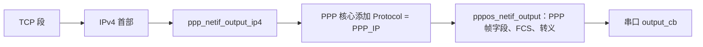

从代码走一遍：[`ppp_netif_output_ip4()`](../src/netif/ppp/ppp.c#L491) → [`ppp_netif_output()`](../src/netif/ppp/ppp.c#L507) → [`pppos_netif_output()`](../src/netif/ppp/pppos.c#L254) → [`pppos_output_last()`](../src/netif/ppp/pppos.c#L902)。完整文件：[ppp.c](../src/netif/ppp/ppp.c)、[pppos.c](../src/netif/ppp/pppos.c)。

### PPPoE：Ethernet 上先建立 PPP 会话

PPPoE 分成发现阶段和会话阶段。典型客户端发现交换是 PADI → PADO → PADR → PADS；PADS 确认后分配会话标识，之后在以太网 PPPoE Session 帧内承载 PPP Protocol 和 PPP 数据。lwIP 在 [`ethernet_input()`](../src/netif/ethernet.c#L210) 按 EtherType 把 PPPoE Discovery/Session 分别交给 PPPoE 模块；会话输入剥掉 Ethernet 与 PPPoE 首部、找到会话后调用 `ppp_input()`，见 [`pppoe_data_input()`](../src/netif/ppp/pppoe.c#L670)。发现状态转换位于 [`pppoe_disc_input()`](../src/netif/ppp/pppoe.c#L387)。

```text
Ethernet 帧 (EtherType 0x8863) -> PPPoE 发现：PADI / PADO / PADR / PADS
Ethernet 帧 (EtherType 0x8864) -> PPPoE 会话首部 | PPP Protocol | IPv4/IPv6 包
逻辑 PPP 接口              -> IPCP/IPv6CP、IP、TCP/UDP/ICMP
```

因此 PPPoE 的物理承载仍是 Ethernet，但 PPP 会话内部是点到点逻辑链路。ARP 可用于 Ethernet 本身的某些邻居通信；然而 PPP 层的 IPv4 数据并不是靠 ARP 在 PPP 对端间寻址。


## 8. IP 和 ICMP：送到哪台主机、如何报告网络情况

### IP

IP（Internet Protocol）负责寻址和跨网络转发。它尽力把数据报送到目标，不保证数据一定到达，也不保证按序到达；丢包后的可靠恢复主要由 TCP 完成。

IPv4 接收时会检查 IP 首部并确认目标/转发路径，再依据 Protocol 字段分发载荷。当前实现中 TCP 是 `6`、ICMP 是 `1`、UDP 是 `17`，分发点在 [`ip4_input()`](../src/core/ipv4/ip4.c#L730)。发包时 [`ip4_output()`](../src/core/ipv4/ip4.c#L1072) 选出网络接口，IPv4 输出代码生成 IP 首部并调用 `netif->output`，见 [`ip4_output_if_opt_src()`](../src/core/ipv4/ip4.c#L874)。

#### IPv4 首部里最值得先懂的字段

| 字段 | 接收/转发中的意义 |
| --- | --- |
| 源 IP、目的 IP | 端到端网络地址；目的 IP 用于本机匹配、转发和上层连接查找 |
| TTL | 每经过一个路由转发点会递减，避免报文在路由环路中无限循环 |
| Protocol | 告诉 IPv4 层把载荷交给 TCP、ICMP、UDP 等哪个模块 |
| Total Length | IPv4 首部与数据的总字节数；接收时用于检查/裁剪 pbuf |
| Identification、Flags、Fragment Offset | 在需要时描述 IPv4 分片；接收端可重组分片 |
| Header Checksum | 只校验 IPv4 首部；TCP、UDP、ICMP 各有自己的校验规则 |

IPv4 输入分发的核心可以压缩成下面几行。真实代码还包含编译开关、UDP-Lite、RAW API 和错误处理：

```c
switch (IPH_PROTO(iphdr)) {
  case IP_PROTO_TCP:
    tcp_input(p, inp);      /* TCP 按连接、序号和 ACK 继续处理 */
    break;
  case IP_PROTO_ICMP:
    icmp_input(p, inp);     /* ICMP 处理 Echo / 错误 / 诊断消息 */
    break;
  case IP_PROTO_UDP:
    udp_input(p, inp);      /* UDP 按端口交给对应 PCB/回调 */
    break;
}
```

源码位置：[`ip4_input()` 分发段](../src/core/ipv4/ip4.c#L728)，[完整 `ip4.c`](../src/core/ipv4/ip4.c)。注意在调用上层前，代码会把 pbuf 的 `payload` 从 IPv4 首部移动到 IP 载荷；这就是逐层“剥头”的实际体现。

#### IPv4 选路、封装与分片

[`ip4_output()`](../src/core/ipv4/ip4.c#L1072) 先调用路由选择，再把包交给指定接口。核心结构如下：

```c
netif = ip4_route_src(src, dest);  /* 依据源/目的地址选择接口 */
if (netif == NULL) {
  return ERR_RTE;                  /* 无可用路由 */
}
return ip4_output_if(p, src, dest, ttl, tos, proto, netif);
```

默认的 [`ip4_route()`](../src/core/ipv4/ip4.c#L152) 会遍历接口，优先找与目标同网段的接口；之后还可能使用 hook 或默认接口。之后 `ip4_output_if_opt_src()` 在 pbuf 前面添加 IPv4 首部、写入目的 IP/TTL/Protocol 并计算首部校验和，然后调用 `netif->output`。若包大于接口 MTU 且启用了 `IP_FRAG`，输出路径会转入 [`ip4_frag()`](../src/core/ipv4/ip4_frag.c#L742)。

不要把 **TCP 分段、IPv4 分片、以太网帧**混为一谈：TCP MSS 决定 TCP 载荷的常见分段大小；IPv4 分片把一个 IP 数据报拆成多个 IP 分片；以太网帧则是链路上传输的外层载体。lwIP 会按接口 MTU 调整有效 MSS，相关函数在 [`tcp_eff_send_mss_netif()`](../src/core/tcp.c#L2248)。

#### 校验和在哪一层计算

| 校验和 | 覆盖范围 | 代码位置/备注 |
| --- | --- | --- |
| Ethernet FCS/CRC | 以太网帧 | 常由 MAC/驱动硬件生成或剥离；`ethernet_input()` 通常从驱动收到已通过硬件检查的帧 |
| IPv4 Header Checksum | 仅 IPv4 首部 | [`ip4_output_if_opt_src()`](../src/core/ipv4/ip4.c#L987) 生成；输入路径按配置校验 |
| TCP Checksum | TCP 首部和数据，并包含 IP 伪首部 | [`tcp_output_segment()`](../src/core/tcp_out.c#L1570) 生成；[`tcp_input()`](../src/core/tcp_in.c#L159) 校验 |
| UDP Checksum | UDP 首部和数据，并包含 IP 伪首部 | [`udp.c`](../src/core/udp.c)；是否生成/校验会受配置影响 |
| ICMP Checksum | ICMP 消息 | Echo 输入校验在 [`icmp_input()`](../src/core/ipv4/icmp.c#L145) |

“伪首部”不是线上额外插入的字段，而是计算 TCP/UDP 校验和时临时把 IP 源/目的地址、协议号和长度纳入计算，帮助检出跨层地址错配。硬件 checksum offload 可让驱动或 MAC 承担部分计算；所以实际源码配置要结合网卡驱动一起看。

### ICMP

ICMP（Internet Control Message Protocol）是 IP 的控制/诊断消息，不使用 TCP/UDP 端口。最熟悉的例子是 `ping`：Echo Request 到达目标后，目标可能通过 Echo Reply 回应。lwIP 的 IPv4 Echo 处理在 [`icmp_input()`](../src/core/ipv4/icmp.c#L80)，其中会校验请求并准备 Echo Reply。

ICMP 也承载网络错误或诊断信息；它不是“保证 IP 可靠”的协议。TCP 是否重传数据，由 TCP 自己根据 ACK、重复 ACK 和重传定时器决定。

| ICMPv4 类型 | 数值 | 典型含义 | lwIP 相关位置 |
| --- | ---: | --- | --- |
| Echo Reply | 0 | 对 ping 请求的回应 | [`icmp_input()`](../src/core/ipv4/icmp.c#L204) |
| Destination Unreachable | 3 | 目的网络/主机/端口等不可达 | [`icmp_dest_unreach()`](../src/core/ipv4/icmp.c#L309) |
| Echo Request | 8 | ping 发起的探测请求 | [`icmp_input()`](../src/core/ipv4/icmp.c#L117) |
| Time Exceeded | 11 | TTL 耗尽，或分片重组超时 | [`ip4_forward()`](../src/core/ipv4/ip4.c#L326)、[`icmp_time_exceeded()`](../src/core/ipv4/icmp.c#L324) |

`traceroute` 一类工具会逐步降低探测包的 TTL；中间路由器转发时发现 TTL 到期，会丢弃该包并通常返回 Time Exceeded，从而让发送端识别路径上的一跳。具体是否返回、是否被防火墙过滤，不由 ICMP 保证。

#### 用 ping 看一次 ICMP Echo

接收 Echo Request 后，lwIP会检查请求长度/校验和，交换 IPv4 源/目的地址，把 ICMP 类型从 Echo Request 改为 Echo Reply，最后通过 IP 输出路径发回。实现允许复用收到的 pbuf：

```c
/* 省略校验与 pbuf 空间检查后的核心动作，见 icmp_input() */
ip4_addr_copy(iphdr->src, *src);                 /* 回复源地址 */
ip4_addr_copy(iphdr->dest, *ip4_current_src_addr());
ICMPH_TYPE_SET(iecho, ICMP_ER);                  /* Echo Reply */
...
ip4_output_if(p, src, LWIP_IP_HDRINCL,
              ICMP_TTL, 0, IP_PROTO_ICMP, inp);
```

完整代码在 [`icmp_input()`](../src/core/ipv4/icmp.c#L204) 与 [完整 `icmp.c`](../src/core/ipv4/icmp.c)。ICMP 回包依旧需要普通 IP 选路和链路层发送；如果目标不在本地网段，也要解析网关 MAC。

## 9. TCP：连接、字节流与三次握手

TCP（Transmission Control Protocol）在两端建立连接，为应用提供可靠、有序的**字节流**。TCP 报文段的边界不等于应用每次写入或读取的边界：一次 `tcp_write()` 可能被拆成多个段，几次写入的数据也可能合并发送。

### 三次握手

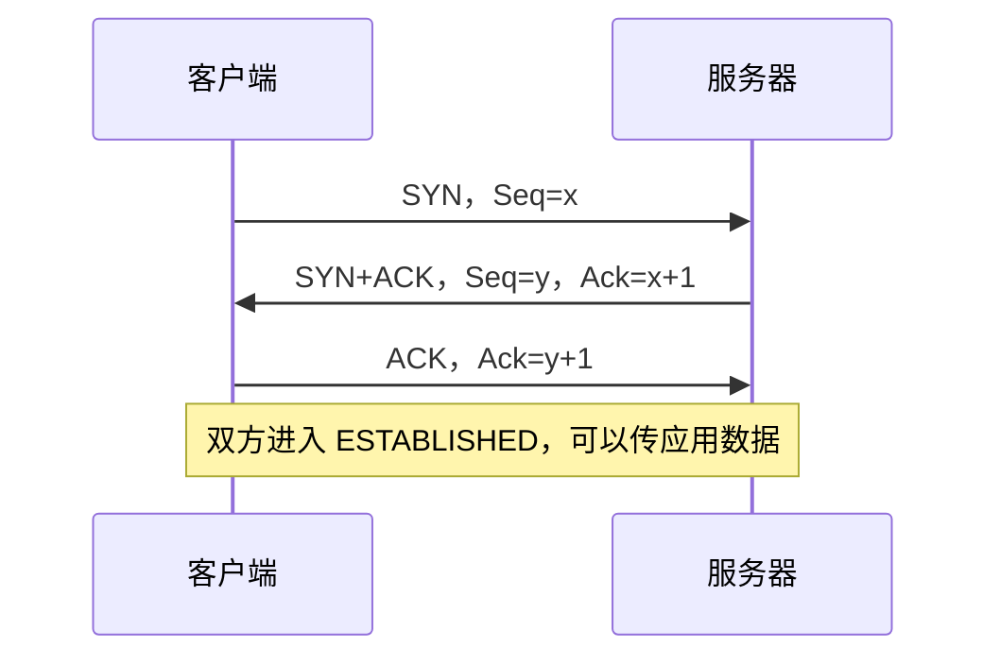

- `SYN` 同步初始序号；SYN 自己也占用一个序号，所以确认值是 `x+1`。
- `ACK` 的含义可以读成“我下一步期待的字节序号”。因此 `Ack=x+1` 表示序号 `x` 的 SYN 已收到。
- 服务器收到 SYN 后建立该连接的控制块、记录客户端序号并排队回复 SYN+ACK，见 [`tcp_listen_input()`](../src/core/tcp_in.c#L630)。
- 客户端的 [`tcp_connect()`](../src/core/tcp.c#L1071) 排队并发送 SYN；收到正确的 SYN+ACK 后，[`tcp_process()`](../src/core/tcp_in.c#L791) 将客户端状态改为 `ESTABLISHED` 并安排第三个 ACK。服务器收到最终 ACK 后也进入 `ESTABLISHED`。

服务器收到 SYN 后的关键状态变化如下。SYN 本身消耗一个序号，所以 `rcv_nxt` 被设成对方初始序号加一；然后排队 SYN+ACK：

```c
npcb->state = SYN_RCVD;
npcb->rcv_nxt = seqno + 1;                  /* 下一步期待客户端的字节/序号 */
...
rc = tcp_enqueue_flags(npcb, TCP_SYN | TCP_ACK);
if (rc == ERR_OK) {
  tcp_output(npcb);
}
```

摘自 [`tcp_listen_input()`](../src/core/tcp_in.c#L675)；完整逻辑还创建 PCB、保存端口/IP、解析 MSS/窗口等选项。完整源码：[tcp_in.c](../src/core/tcp_in.c)。客户端发 SYN 的状态设置见 [`tcp_connect()`](../src/core/tcp.c#L1148)。

#### TCP 序号、确认号和窗口字段

| 字段 | 发送方怎么理解 | 例子 |
| --- | --- | --- |
| `Seq` | 本段第一个数据字节的序号；SYN/FIN 也各占一个序号 | `Seq=1000, Len=500` 覆盖字节序号 1000–1499 |
| `Ack` | 累计确认：我下一步期待的序号 | `Ack=1500` 表示 1500 以前的连续字节均收到 |
| `Window` | 本端当前愿意再接收多少数据的通告值 | 对端据此调整流量控制窗口 |
| `MSS` | 对端愿意接收的单个 TCP 段最大数据长度选项 | 不是 IP MTU；IP/TCP 首部会占用 MTU 空间 |

lwIP 的 `rcv_nxt` 表示下一步期待接收的序号，`snd_nxt` 跟踪下一步发送序号，`lastack` 保存累计确认进度。TCP 仍是字节流：即使应用一次写入 2 KB，TCP 也可以分多个段传输，应用接收时也不一定按原写入边界读到。

lwIP 用 `tcp_pcb`（protocol control block）保存每条连接的状态、端口、序号、窗口和队列。看 TCP 状态机时，先在 [`tcp_input()`](../src/core/tcp_in.c#L246) 找到连接，再跟进 [`tcp_process()`](../src/core/tcp_in.c#L862)。

## 10. TCP 的流量控制和拥塞控制

这两个概念容易混在一起，但回答的是不同问题：

| 控制机制 | 它保护谁/什么 | 关键量 | 谁提供信息 |
| --- | --- | --- | --- |
| 流量控制（flow control） | 接收端缓冲区，避免发送端把接收端压垮 | 接收端通告窗口 `rwnd`；发送方 PCB 中记录为 `snd_wnd` | 接收端在 TCP Window 字段里通告 |
| 拥塞控制（congestion control） | 网络路径，避免发送端持续注入过多数据 | 发送端拥塞窗口 `cwnd`、慢启动门限 `ssthresh` | 发送端根据 ACK、丢包和超时调整 |

在 lwIP 的 [`tcp_output()`](../src/core/tcp_out.c#L1266) 中，允许发送的窗口上限取 `min(snd_wnd, cwnd)`。直观地说，发送方同时受“对端还能收多少”和“网络目前适合发多少”限制；已经在途但尚未确认的数据也占用这个额度。`tcp_output()` 会在段落进发送队列之前检查段是否落在窗口内，见 [`tcp_out.c`](../src/core/tcp_out.c#L1335)。

源码核心逻辑是：

```c
wnd = LWIP_MIN(pcb->snd_wnd, pcb->cwnd);
...
while (seg != NULL &&
       seq(seg) - pcb->lastack + seg->len <= wnd) {
  tcp_output_segment(seg, pcb, netif);
  /* 成功输出的段从 unsent 移入 unacked，等待 ACK */
}
```

这是概念化摘录；实际代码使用 TCP 序号比较宏处理 32 位回绕，还会考虑 Nagle、SYN/FIN、路由、接口状态和输出错误。完整发送队列实现见 [`tcp_output()`](../src/core/tcp_out.c#L1241)。

**流量控制例子：**接收端应用还没来得及读取数据，接收缓存逐渐占满，TCP 通告窗口就会缩小，甚至变成 0。应用读取并释放空间后，会调用 `tcp_recved()` 通知协议栈；lwIP 更新可用接收窗口，必要时发送窗口更新，见 [`tcp_recved()`](../src/core/tcp.c#L972)。

简化看 `tcp_recved(pcb, len)` 的效果：

```c
pcb->rcv_wnd += len;                  /* 应用已消费数据，接收缓存可用空间增加 */
tcp_update_rcv_ann_wnd(pcb);          /* 更新准备通告给对端的窗口 */
if (window_grew_enough) {
  tcp_ack_now(pcb);
  tcp_output(pcb);                    /* 及时告诉发送端可以继续发 */
}
```

变量名中的 `snd_wnd` 是“本端发送方向看到的对端窗口”，`rcv_wnd` 是“本端接收侧剩余容量”；这两个方向相反，初学时很容易看反。发送端拿到对方通告的 Window 后，在 [`tcp_receive()`](../src/core/tcp_in.c#L1162) 更新 `snd_wnd`。

**拥塞控制的简化图景：**连接刚建立时 `cwnd` 较小；慢启动阶段随新 ACK 较快增长；到 `ssthresh` 附近后进入拥塞避免，增长较慢。发生丢包后，lwIP 会降低拥塞窗口/门限，再逐渐恢复。ACK 驱动的调整在 [`tcp_receive()`](../src/core/tcp_in.c#L1260)，连接建立时的初始窗口设置在 [`tcp_process()`](../src/core/tcp_in.c#L883)。具体数值和扩展行为会受版本与编译配置影响。

对应代码不是根据时间盲目加窗口，而是根据新确认了多少字节来更新：

```c
if (pcb->cwnd < pcb->ssthresh) {
  /* 慢启动：随 ACK 增加 cwnd，较快探测容量 */
  increase = LWIP_MIN(acked, num_seg * pcb->mss);
  TCP_WND_INC(pcb->cwnd, increase);
} else {
  /* 拥塞避免：累计已确认字节，约每 cwnd 字节增加一个 MSS */
  pcb->bytes_acked += acked;
  if (pcb->bytes_acked >= pcb->cwnd) {
    pcb->bytes_acked -= pcb->cwnd;
    TCP_WND_INC(pcb->cwnd, pcb->mss);
  }
}
```

摘自 [`tcp_receive()`](../src/core/tcp_in.c#L1260)。三件事要分开：`TCP_SND_BUF` 限制本机可排队的发送数据内存；`snd_wnd` 是接收端流控；`cwnd` 是拥塞控制。真正能推进发送的有效额度还受三者共同影响。

## 11. TCP 重传：重复 ACK 和超时

IP 和以太网不替 TCP 保证端到端可靠性。TCP 保留未确认的数据，发现缺口后重新发送。

### 快速重传：多个重复 ACK 暗示中间有缺口

```text
发送方发出：Seq=1000、Seq=1500、Seq=2000
接收方收到：Seq=1000、Seq=2000（Seq=1500 丢失）

接收方反复确认：Ack=1500，表示“我仍缺 1500 开始的数据”
收到 3 个重复 ACK 后，发送方快速重传从 Seq=1500 开始的段
```

lwIP 按 TCP 重复 ACK 条件计数；达到 3 个后调用快速重传，见 [`tcp_receive()`](../src/core/tcp_in.c#L1189) 和 [`tcp_rexmit_fast()`](../src/core/tcp_out.c#L1782)。这不需要等完整重传超时。

```c
if (is_duplicate_ack) {
  ++pcb->dupacks;
  if (pcb->dupacks >= 3) {
    tcp_rexmit_fast(pcb);       /* 重发最早仍未确认的段 */
  }
}
```

这里的 `is_duplicate_ack` 不是单看 ACK 号没变化；lwIP 还检查 ACK 没确认新数据、没有载荷、窗口没变化、确实有未确认数据等条件。条件列表与判断都在 [`tcp_receive()`](../src/core/tcp_in.c#L1189)。快速重传把第一个未确认段挪回待发送队列；拥塞窗口调整在 [`tcp_rexmit_fast()`](../src/core/tcp_out.c#L1787)。

### RTT 与 RTO：多久没确认才算超时

TCP 用 RTT（往返时延）样本估计 RTO（重传超时）。直观上，RTT 表示“发出数据到收到确认”的时间；RTO 要给正常网络波动留余量，太短会误重传，太长则丢包恢复慢。lwIP 根据被确认的数据更新平滑 RTT 与变化量，再形成 RTO；实现状态存在 PCB 的 `sa`、`sv`、`rto` 字段，计算在 [`tcp_receive()`](../src/core/tcp_in.c#L1344)。

发生重传后，ACK 可能对应原始发送，也可能对应重传，无法可靠判断 RTT 样本来自哪次发送。因此 lwIP 在重传路径清除当前 RTT 测量，避免把有歧义的样本直接用于更新，见 [`tcp_rexmit_rto_prepare()`](../src/core/tcp_out.c#L1635) 和 [`tcp_rexmit()`](../src/core/tcp_out.c#L1723)。

### 超时重传：迟迟没有确认

每条连接会跟踪重传计时器。超时后，lwIP 把未确认段重新排队并调用输出；同时增大后续 RTO 等待时间，并将 `cwnd` 收缩到一个 MSS 重新探测。相关处理在 [`tcp_slowtmr()`](../src/core/tcp.c#L1274)、[`tcp_rexmit_rto_prepare()`](../src/core/tcp_out.c#L1635) 和 [`tcp_rexmit_rto()`](../src/core/tcp_out.c#L1711)。若重试次数超过配置上限，连接最终会被放弃；默认上限定义可查 [`TCP_MAXRTX`](../src/include/lwip/opt.h#L1302)。

超时路径的重要动作可概括成：

```c
if (pcb->rtime >= pcb->rto) {
  if (tcp_rexmit_rto_prepare(pcb) == ERR_OK) {
    pcb->rto = backed_off_rto;    /* 退避：后续等待时间加长 */
    pcb->ssthresh = max(effective_window / 2, 2 * pcb->mss);
    pcb->cwnd = pcb->mss;         /* 从小窗口重新探测 */
    tcp_rexmit_rto_commit(pcb);   /* 重新输出已超时段 */
  }
}
```

这是省略边界处理后的逻辑摘要，函数名对应真实实现。真实代码还处理 SYN 状态、重试上限、定时器和发送失败等情况。完整顺序可读 [`tcp_slowtmr()`](../src/core/tcp.c#L1279)：先准备重传队列，再计算带退避的 RTO、回退拥塞窗口，最后提交重传；队列操作分别在 [`tcp_rexmit_rto_prepare()`](../src/core/tcp_out.c#L1635) 和 [`tcp_rexmit_rto_commit()`](../src/core/tcp_out.c#L1690)。

快速重传利用重复 ACK 尽早恢复；超时重传用于 ACK 不足以指出缺口的情形。两者的重传数据仍经过 IP、ARP/链路层和网卡输出路径。

还有一种容易混淆的情况：接收端通告 `rwnd=0` 表示“接收缓冲区暂时满了”，不是网络拥塞信号，也不等于丢包。发送端会暂停普通数据发送，并使用 persist 定时器偶尔发零窗口探测，避免窗口重新打开的 ACK 丢失后双方永久等待。lwIP 的窗口更新/persist 启动在 [`tcp_output()`](../src/core/tcp_out.c#L1310)，定时处理在 [`tcp_slowtmr()`](../src/core/tcp.c#L1239)，探测段在 [`tcp_zero_window_probe()`](../src/core/tcp_out.c#L2178)。

## 12. TCP 乱序重排：先缓存缺口之后的数据

IP 网络可能让不同报文走不同路径，所以接收顺序可能与发送顺序不同。TCP 向应用提供有序字节流：缺口补齐前，不会把后续字节越过缺口交给应用。

```text
期望序号 rcv_nxt = 1000

先收到 Seq=1500 的数据：
  放进 pcb->ooseq（乱序队列）
  累计确认仍是 Ack=1000，表示缺少从 1000 开始的数据

后来收到 Seq=1000 的数据：
  rcv_nxt 前进到 1500
  若 ooseq 里的段正好从 1500 接上，就把它接上并继续前进
  合并后的连续数据再交给应用
```

[`tcp_receive()`](../src/core/tcp_in.c#L1460) 处理按序数据并推进 `rcv_nxt`；如果后续段因此变成连续数据，会从 `pcb->ooseq` 取出并接到交付给应用的缓冲区中，见 [`tcp_in.c`](../src/core/tcp_in.c#L1575)。乱序段的保存和排序入口在 [`tcp_in.c`](../src/core/tcp_in.c#L1650)。是否排队由 `TCP_QUEUE_OOSEQ` 控制；`opt.h` 中的默认定义是跟随 `LWIP_TCP`，但应用的 `lwipopts.h` 可以覆盖默认值，见 [`opt.h`](../src/include/lwip/opt.h#L1317)。

代码里先判断当前段是不是正好从 `rcv_nxt` 开始。连续时推进 `rcv_nxt`；否则，在启用 `TCP_QUEUE_OOSEQ` 时把段放进 `pcb->ooseq`：

```c
if (seqno == pcb->rcv_nxt) {
  pcb->rcv_nxt = seqno + tcplen;      /* 当前段正好填补缺口 */
  while (pcb->ooseq != NULL &&
         pcb->ooseq->seqno == pcb->rcv_nxt) {
    pcb->rcv_nxt += ooseq_segment_length;
    append_to_recv_data(pcb->ooseq);  /* 把相邻的缓存段接起来交付 */
  }
} else {
  insert_by_sequence(pcb->ooseq, incoming_segment);
  send_cumulative_ack(pcb->rcv_nxt); /* ACK 仍指向第一个缺失字节 */
}
```

这是对 [`tcp_receive()`](../src/core/tcp_in.c#L1460) 的逻辑摘要；源码还会处理重叠、重复段、接收窗口边界、FIN 和可选 SACK。真实连续队列合并在 [`tcp_in.c`](../src/core/tcp_in.c#L1575)，乱序插入从 [`tcp_in.c`](../src/core/tcp_in.c#L1650) 开始。

注意：**接收端的乱序重排**和**发送端的丢包重传**互相配合，但不是同一个动作。接收端缓存后来到达的数据、重复确认缺失位置；发送端看到重复 ACK 后，才可能快速重传缺失段。

### Raw TCP API：应用怎样接上 TCP 状态机

lwIP 的 raw API 用回调表达连接生命周期。应用持有 `tcp_pcb`，注册回调；协议核心在正确的上下文里处理收到的段，再通知应用：

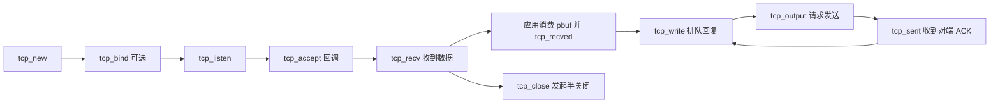

常用函数声明在 [`tcp.h`](../src/include/lwip/tcp.h#L410)，实现分布在 [`tcp.c`](../src/core/tcp.c) 和 [`tcp_out.c`](../src/core/tcp_out.c)：[`tcp_new()`](../src/core/tcp.c#L1953)、[`tcp_bind()`](../src/core/tcp.c#L662)、[`tcp_accept()`](../src/core/tcp.c#L2086)、[`tcp_recv()`](../src/core/tcp.c#L2020)、[`tcp_sent()`](../src/core/tcp.c#L2040)、[`tcp_write()`](../src/core/tcp_out.c#L393)、[`tcp_close()`](../src/core/tcp.c#L484)。

读 raw API 时先理解三个边界：

1. `tcp_write()` 通常只是把数据复制或引用到 TCP 发送队列；它成功不代表数据已经上网。
2. `tcp_output()` 尝试把当前窗口允许的段发出去；未被确认的段仍保留在 `unacked` 队列。
3. `tcp_sent()` 通知应用远端确认了数据；接收回调中的 `pbuf` 由应用按 API 约定释放。应用读完多少数据，就用 `tcp_recved()` 通知 TCP 增加接收窗口。

如果发送队列/内存暂时不足，`tcp_write()` 可以返回 `ERR_MEM`；应用需要等 ACK 释放资源后再重试，不能把它当成成功发送。socket/netconn API 把这类细节包装成更像操作系统的读写接口，但底层仍会落到 TCP PCB 和相同的协议核心。

### TCP 连接关闭：FIN 是有序关闭，不是立即销毁

TCP 是全双工连接，两端发送方向可以分别关闭。常见主动关闭过程：

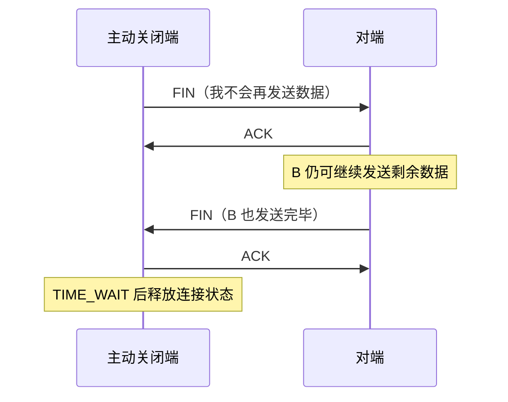

raw API 的 [`tcp_close()`](../src/core/tcp.c#L484) 会发起发送侧关闭，FIN 会进入 TCP 输出队列；收到 FIN 后，`tcp_receive()` 设置关闭事件，状态机在 [`tcp_process()`](../src/core/tcp_in.c#L992) 中转到 `CLOSE_WAIT`、`FIN_WAIT_2`、`TIME_WAIT` 等状态。`tcp_close()` 不是“立即把 PCB 和报文缓冲全部 free 掉”；具体何时释放取决于 TCP 状态、剩余数据及 ACK。

## 13. 应用接口：Raw、Netconn 与 Socket

lwIP 提供三种常见 API 风格。它们最终复用同一套 TCP/IP 核心，区别在于应用如何调用协议栈、如何等待结果，以及暴露多少底层细节。

| API | 调用方式 | 适合场景 | 主要约束 |
| --- | --- | --- | --- |
| Raw API | 协议事件通过回调通知应用 | 裸机、资源紧张、需要精细控制 | 必须在 lwIP 协议核心上下文调用；回调也在该上下文运行，不能长时间阻塞 |
| Netconn API | 顺序/阻塞式接口，通过 netconn 对象操作 | 使用 RTOS、希望比 raw API 更像同步读写 | 需要 `NO_SYS=0`；应用任务通过消息与信号量同 tcpip 协议核心协作 |
| Socket API | BSD/POSIX 风格的 socket 描述符和 `send/recv` 等函数 | 迁移已有 socket 应用、采用常见客户端/服务器结构 | 通常要求 `LWIP_NETCONN=1`、`LWIP_SOCKET=1` 和 RTOS 运行模型；占用 socket/netconn/PCB/报文资源 |

在多线程模式下，socket 并不是一份独立 TCP 实现。应用拿到的整数 `fd` 是 lwIP socket 表中的句柄；对应的 [`struct lwip_sock`](../src/include/lwip/priv/sockets_priv.h#L67) 持有一个 `netconn` 指针，而 `netconn` 再关联 TCP、UDP 或 Raw PCB，并提供跨线程通信所需的邮箱/信号量。可以把对象关系记为 **fd → `lwip_sock` → `netconn` → PCB**，其中 fd 不是 PCB，也不是 TCP 连接状态本身。

[`lwip_socket()`](../src/api/sockets.c#L1725) 根据 `SOCK_STREAM`、`SOCK_DGRAM` 或 `SOCK_RAW` 创建相应类型的 netconn，再登记 socket 表项；`lwip_accept()` 为已建立的客户端连接取得新的 netconn，并创建新的 socket 句柄。`lwip_send()`、`lwip_recv()` 等调用 netconn 接口。Netconn 层通过 [`netconn_apimsg()`](../src/api/api_lib.c#L118) 把需要修改协议状态的操作送到 tcpip 协议核心；核心在线程中执行 TCP/UDP PCB 操作，收到数据或状态变化后再通过消息邮箱和信号量唤醒等待中的应用任务。对应实现见 [`sockets.c`](../src/api/sockets.c)、[`sockets_priv.h`](../src/include/lwip/priv/sockets_priv.h#L67)、[`api_lib.c`](../src/api/api_lib.c)、[`api_msg.c`](../src/api/api_msg.c) 与 [`tcpip.c`](../src/api/tcpip.c#L136)。

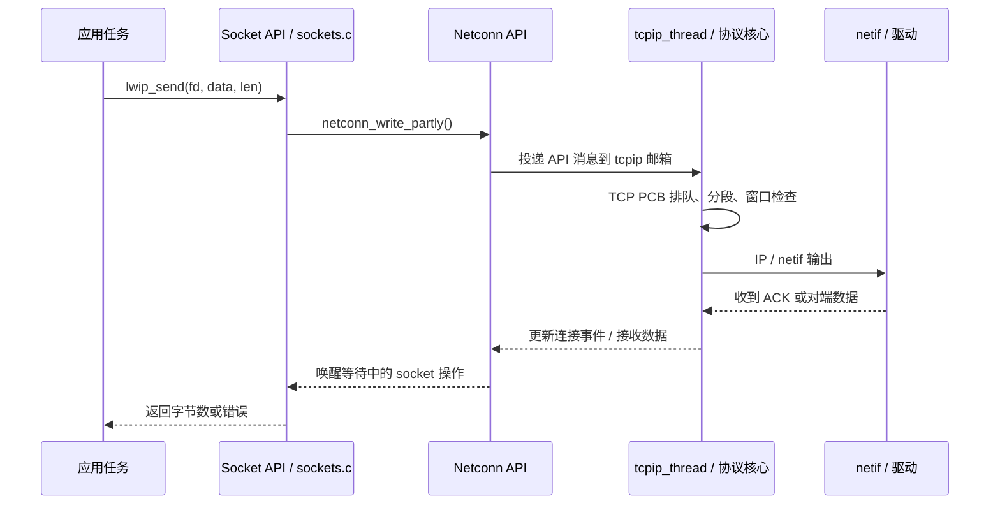

### TCP Socket 服务端的典型调用顺序

```c
int listen_fd = lwip_socket(AF_INET, SOCK_STREAM, IPPROTO_TCP);
struct sockaddr_in local = {0};
local.sin_family = AF_INET;
local.sin_port = lwip_htons(8080);
local.sin_addr.s_addr = INADDR_ANY;

lwip_bind(listen_fd, (struct sockaddr *)&local, sizeof(local));
lwip_listen(listen_fd, 4);
int client_fd = lwip_accept(listen_fd, NULL, NULL);

char buf[128];
int n = lwip_recv(client_fd, buf, sizeof(buf), 0);
if (n > 0) {
  /* TCP 是字节流：send 可能只接受一部分数据，应用要按返回值继续处理 */
  lwip_send(client_fd, buf, (size_t)n, 0);
}

lwip_close(client_fd);
lwip_close(listen_fd);
```

这是说明调用关系的示例，产品代码还要逐一检查 `-1`/错误码、处理多次 `recv()`、循环发送未完成的数据，并决定客户端断开、超时和并发连接策略。服务端流程是 `socket → bind → listen → accept → recv/send → close`；客户端是 `socket → connect → send/recv → close`。源码对应 [`lwip_bind()`](../src/api/sockets.c#L758)、[`lwip_listen()`](../src/api/sockets.c#L921)、[`lwip_accept()`](../src/api/sockets.c#L659)、[`lwip_connect()`](../src/api/sockets.c#L853)、[`lwip_recv()`](../src/api/sockets.c#L1315) 和 [`lwip_send()`](../src/api/sockets.c#L1422)。

### 等待多个 socket：`select()` 与 `poll()`

当一个任务管理多个连接时，如果对每个连接依次调用阻塞式 `recv()`，第一个暂时没数据的连接就会挡住后面的连接。多路复用的做法是先把一组 fd 和感兴趣的事件交给 `select()` 或 `poll()`；接口等到至少一个事件就绪、超时或出错后返回，应用只处理返回的就绪项。

| 项目 | `select()` | `poll()` |
| --- | --- | --- |
| 输入 | `readset`、`writeset`、`exceptset` 三个 `fd_set` | `struct pollfd` 数组，每项包含 fd、关注事件和返回事件 |
| 返回结果 | 原集合被改写为就绪集合；`maxfdp1` 应为最大 fd 加 1 | 各项 `revents` 标出就绪事件；返回有事件的数组项数 |
| 超时单位 | `struct timeval`，传 `NULL` 表示一直等待，零超时表示立即检查 | 毫秒；负数表示一直等待，0 表示立即检查 |
| 迭代注意点 | 每次调用前重新 `FD_ZERO/FD_SET`，因为传入集合会被改写 | 每次调用前设置 `events`；返回的 `revents` 由 lwIP 填写 |
| 配置 | `LWIP_SOCKET_SELECT` | `LWIP_SOCKET_POLL` |

常用就绪含义：读就绪表示现在调用 `recv()` / `accept()` 有意义；写就绪表示本地发送资源允许尝试 `send()`；错误就绪表示应检查连接状态或错误。可读并不保证读到正数字节——TCP 对端有序关闭时，读就绪后 `recv()` 可能返回 0；可写也不保证一次 `send()` 写完全部数据。

**`select()` 用法示例：**

```c
#include "lwip/sockets.h"

int wait_readable(int client_fd)
{
  fd_set readfds;
  struct timeval timeout;
  int ret;

  FD_ZERO(&readfds);
  FD_SET(client_fd, &readfds);
  timeout.tv_sec = 1;
  timeout.tv_usec = 0;

  /* maxfdp1 = 最大 fd + 1；超时后 ret == 0 */
  ret = lwip_select(client_fd + 1, &readfds, NULL, NULL, &timeout);
  if (ret < 0) {
    return -1; /* errno 表示失败原因 */
  }
  if (ret == 0) {
    return 0;  /* 本轮超时，没有 socket 就绪 */
  }
  if (FD_ISSET(client_fd, &readfds)) {
    char buf[128];
    int n = (int)lwip_recv(client_fd, buf, sizeof(buf), 0);
    if (n == 0) {
      return 2; /* 对端有序关闭 */
    }
    if (n < 0) {
      return -1;
    }
    /* 处理 buf[0..n)，不要假设它对应对端的一次 send() */
    return 1;
  }
  return 0;
}
```

**`poll()` 用法示例：**

```c
#include "lwip/sockets.h"

int wait_readable_poll(int client_fd)
{
  struct pollfd pfd;
  int ret;

  pfd.fd = client_fd;
  pfd.events = POLLIN; /* 关注接收就绪 */
  pfd.revents = 0;

  ret = lwip_poll(&pfd, 1, 1000); /* 等待最多 1000 ms */
  if (ret < 0) {
    return -1;
  }
  if (ret == 0) {
    return 0; /* 超时 */
  }
  if ((pfd.revents & POLLNVAL) != 0) {
    return -1; /* fd 无效 */
  }
  if ((pfd.revents & POLLERR) != 0) {
    return -1; /* socket 报告错误 */
  }
  if ((pfd.revents & POLLIN) != 0) {
    char buf[128];
    int n = (int)lwip_recv(client_fd, buf, sizeof(buf), 0);
    if (n == 0) {
      return 2; /* 对端有序关闭 */
    }
    if (n < 0) {
      return -1;
    }
    /* 处理 buf[0..n) */
    return 1;
  }
  return 0;
}
```

lwIP 在 [`sockets.h`](../src/include/lwip/sockets.h#L618) 声明这两个 API；`pollfd` 及 `POLLIN/POLLOUT/POLLERR/POLLNVAL` 定义见 [`sockets.h`](../src/include/lwip/sockets.h#L503)。仓库当前实现没有实现 `POLLHUP` 等标记（头文件将部分标记注明为未实现），应用应依据可用的就绪位和 `recv()` 返回值处理关闭。`select()` 的 fd 集合大小还受 `FD_SETSIZE`/`LWIP_SELECT_MAXNFDS` 限制；描述符很多或需要更简洁地维护动态数组时，通常优先考虑 `poll()`。

### 多任务共享 socket 与并发 `close()`

RTOS 程序有时会让一个任务读、另一个任务写，并由管理任务关闭连接。这样会让 `recv()`、`send()` 与 `close()` 在时间上重叠。lwIP 默认不打开 full-duplex 保护；如果产品确实需要同一个 netconn/socket 被多个线程同时使用，应启用 `LWIP_NETCONN_FULLDUPLEX=1`，并且必须同时启用 `LWIP_NETCONN_SEM_PER_THREAD=1`。后者为每个调用 socket/netconn API 的线程提供独立完成信号量，避免多个阻塞 API 争用同一信号量。

下面的片段只展示线程本地信号量的生命周期，省略了任务主循环。每个会调用 socket/netconn API 的任务都要各自初始化和清理：

```c
/* 每个会调用 lwIP socket/netconn API 的 RTOS 任务都执行一次。 */
void my_socket_task(void *arg)
{
  lwip_socket_thread_init();

  /* 在这里执行该任务负责的 lwip_recv/lwip_send/lwip_poll 等操作。 */
  (void)arg;

  lwip_socket_thread_cleanup();
}
```

在允许并发关闭的配置下，操作开始时 `get_socket()` 会取得 `lwip_sock` 的使用引用；`lwip_close()` 完成 netconn 删除准备、进入 socket 表项回收阶段后，若仍有其他引用，`free_socket_locked()` 会设置 `fd_free_pending`，从而拒绝新的引用。原有操作返回时通过 `done_socket()` 归还引用，最后一个使用者负责完成清理。该设计防止释放中的内存被并发访问，也防止 socket 表槽位过早复用。关闭进行期间启动的操作可能因 netconn 已进入删除状态而失败，因此应用仍要对停止新请求和处理错误返回负责。

`LWIP_NETCONN_FULLDUPLEX` **不等于应用可以忽略线程同步**：它保护 lwIP 内部对象的生命周期，不替应用串行化多写者、决定谁拥有连接，或保证关闭后旧 fd 还能使用。应用仍应先通知工作任务停止发起新操作，并按自己的任务管理方式等待它们退出；如果必须让 `close()` 与正在执行的读写重叠，这项配置才负责把正在进行的 lwIP 调用与对象回收协调起来。关闭之后，应用不得继续把旧 fd 交给其他任务使用。

若不启用 full-duplex，请用互斥锁保护同一 socket 的所有操作，或采用“一个任务独占 socket、其他任务通过队列发命令”的结构。这个单所有者模型通常更容易推理，也避免并发写入时应用层消息交错。配置和状态字段的实现见 [`opt.h`](../src/include/lwip/opt.h#L1988)、[`sockets_priv.h`](../src/include/lwip/priv/sockets_priv.h#L84)、[`sock_inc_used()` / `done_socket()`](../src/api/sockets.c#L371) 与 [`lwip_close()`](../src/api/sockets.c#L812)。

**TCP 与 UDP 的应用读写语义不同。**TCP `recv()` 返回当前可读字节数，不对应对端一次 `send()`；需要应用协议自己定义消息边界，例如固定长度、长度前缀或分隔符。UDP 通过 `SOCK_DGRAM` 和 `sendto()/recvfrom()` 操作独立数据报；一次接收读一个数据报，应用要检查来源地址和缓冲区是否过小。UDP `connect()` 只是为 datagram 设定默认对端，不会进行 TCP 握手。

Socket 资源也是有限的。除 `LWIP_SOCKET`/`LWIP_NETCONN` 外，还要按最大并发量检查 `MEMP_NUM_NETCONN`、TCP/UDP PCB 池、TCP 段池、接收/发送缓存与 pbuf pool。socket 描述符只是 API 句柄，不等于 TCP PCB，也不等于网卡接口。

## 14. lwIP 移植到 RTOS：从系统抽象层到网卡驱动

移植的核心不是重写 TCP/IP，而是给 lwIP 提供两类适配：**把 RTOS 的任务/队列/信号量/时钟映射到 `sys_arch`；把具体网卡映射为 `netif` 驱动。**lwIP 仓库提供 FreeRTOS 的参考实现：[FreeRTOS `sys_arch.c`](../contrib/ports/freertos/sys_arch.c)、[FreeRTOS `sys_arch.h`](../contrib/ports/freertos/include/arch/sys_arch.h)。

### 14.1 选择运行模型和配置

使用 RTOS 时通常设 `NO_SYS=0`，由 `tcpip_init()` 建立 tcpip 线程和消息邮箱。需要线程式应用时启用 `LWIP_NETCONN`；需要 BSD socket 时再启用 `LWIP_SOCKET`。`SYS_LIGHTWEIGHT_PROT` 用于短临界区/轻量保护；`LWIP_TCPIP_CORE_LOCKING` 是否启用取决于端口的 core 互斥策略，不应只为“看起来安全”而打开。

每个产品通过 `lwipopts.h` 选择 IPv4/IPv6、TCP/UDP、DHCP、socket、内存池和资源数量。还要设置合理的 `TCPIP_THREAD_STACKSIZE`、`TCPIP_THREAD_PRIO` 和 `TCPIP_MBOX_SIZE`。配置默认说明见 [`opt.h`](../src/include/lwip/opt.h#L77)；初始化和线程创建见 [`tcpip_init()`](../src/api/tcpip.c#L659) 与 [`tcpip_thread()`](../src/api/tcpip.c#L136)。

#### 构建集成：配置头文件、移植层和源文件

移植时要把三类文件纳入工程，并确保编译器能找到它们：

| 类别 | 工程中需要提供/选择的内容 | 仓库参考 |
| --- | --- | --- |
| 协议配置 | 产品自己的 `lwipopts.h`，决定功能开关、池大小、线程参数 | [`example_app/lwipopts.h`](../contrib/examples/example_app/lwipopts.h)、[`opt.h` 默认配置](../src/include/lwip/opt.h) |
| OS/编译器适配 | `arch/cc.h`、`arch/sys_arch.h`、`sys_arch.c`，映射基本类型、对齐、临界区、RTOS 原语 | [FreeRTOS 端口目录](../contrib/ports/freertos) |
| 协议栈与端口源文件 | 根据启用的 IPv4/IPv6、Socket、PPP 等功能选择 core、API、netif 与 OS 端口源文件 | [`src/Filelists.cmake`](../src/Filelists.cmake)、[`BUILDING`](../BUILDING#L45) |

头文件搜索路径至少要覆盖 `src/include`、端口的 `include` 目录和放置 `lwipopts.h` 的目录；使用 contrib 中的适配或示例时，还要加入 `contrib`。构建系统要编译协议栈源文件、RTOS 适配文件以及产品自己的网卡驱动。不要只把头文件加进工程，也不要不看配置就把仓库所有 `.c` 文件一股脑编译：源文件集合需要与功能宏、所选网卡/链路适配及 OS 端口匹配。仓库的 [`BUILDING`](../BUILDING#L58) 和 [`Filelists.cmake`](../src/Filelists.cmake#L37) 展示了 CMake 集成和按功能分组的源文件清单。

### 14.2 实现 `arch` 与 `sys_arch`

| 接口组 | 对接的 RTOS 能力 | 需要保证的语义 |
| --- | --- | --- |
| `sys_thread_new()` | 创建任务 | 按请求的入口、参数、栈大小和优先级启动任务；tcpip 线程不能创建失败 |
| `sys_mbox_*()` | 指针消息队列 | mailbox 传递的是消息指针；区分阻塞投递、非阻塞投递和 ISR 版本 |
| `sys_sem_*()` | 信号量/事件量 | 支持初值、阻塞等待、超时和释放；超时返回 `SYS_ARCH_TIMEOUT` |
| `sys_mutex_*()` | 互斥锁 | 保护需要互斥访问的 API/core 状态；锁的策略与 `LWIP_TCPIP_CORE_LOCKING` 配套 |
| `sys_arch_protect()` / `unprotect()` | 短临界区或中断保护 | 成对实现、支持嵌套约定，并返回/恢复正确的保护状态 |
| `sys_now()` | 单调毫秒时钟 | 以毫秒为单位并能安全跨越计数器回绕；TCP/IP 定时器依赖它 |
| `sys_init()`、`sys_msleep()` | RTOS 初始化和延时 | 为上述对象提供基础初始化与毫秒延时 |

`sys_arch.c` 是移植者的实现文件，`lwip/sys.h` 定义契约；`arch/cc.h` 还需要提供编译器相关的基本类型、对齐、诊断和字节序宏，`arch/sys_arch.h` 定义 RTOS 对象类型。调用语义以 [`sys.h`](../src/include/lwip/sys.h) 为准。FreeRTOS 参考端口分别用 `xTaskCreate`、消息队列、信号量、临界区和系统节拍实现这些接口；例如 [`sys_thread_new()`](../contrib/ports/freertos/sys_arch.c#L462)、[`sys_arch_sem_wait()`](../contrib/ports/freertos/sys_arch.c#L283)、[`sys_arch_mbox_fetch()`](../contrib/ports/freertos/sys_arch.c#L385)、[`sys_arch_protect()`](../contrib/ports/freertos/sys_arch.c#L140) 和 [`sys_now()`](../contrib/ports/freertos/sys_arch.c#L125)。

**ISR 与任务上下文要分清。**可能阻塞的 `sys_mbox_post()`、socket 调用和大部分 lwIP API 不能直接在中断服务程序中执行。常见做法是在 ISR 中确认/记录 DMA 接收并唤醒网卡接收任务，再由该任务构造 pbuf 并调用 `netif->input()`；若要从 ISR 投递消息，只能使用端口明确实现的 ISR-safe 非阻塞接口，并正确请求切换到被唤醒的高优先级任务。

### 14.3 把网卡驱动接到 `netif`

1. 准备 `netif` 初始化函数：填写 MTU、硬件地址、能力标志，以及 IPv4/IPv6 输出回调和最终 `linkoutput`。
2. 用 `netif_add()` 注册接口，并把驱动私有对象放入 `netif->state`。在 `NO_SYS=0` 模式下，驱动收包通常经 `netif->input` 指向的 `tcpip_input()` 排队给 tcpip 线程。
3. RX 侧读取 DMA/硬件帧，构造或包装 pbuf，交给 `netif->input()`；成功后转移所有权，失败时按契约释放。
4. TX 侧实现 `linkoutput`，把最终帧提交给 MAC/DMA。若硬件异步发送，必须保留/引用 pbuf，直到 DMA 完成后再释放；同时处理缓存 clean/invalidate、对齐和描述符回收。
5. 初始化完成后调用 `netif_set_up()`；检测到物理链路可用/断开时分别更新 link 状态。按产品需要配置静态地址或启动 DHCP。

以太网输入/输出框架可参考 [`ethernetif.c`](../contrib/examples/ethernetif/ethernetif.c#L184)、[`ethernet_input()`](../src/netif/ethernet.c#L81) 和以太网协议输出回调。该示例中的硬件读帧语句是留给平台实现的占位代码，适合学习 pbuf 链和驱动调用顺序；产品驱动的描述符、cache 和 DMA 细节必须结合芯片手册确认。

### 14.4 启动顺序与联调顺序

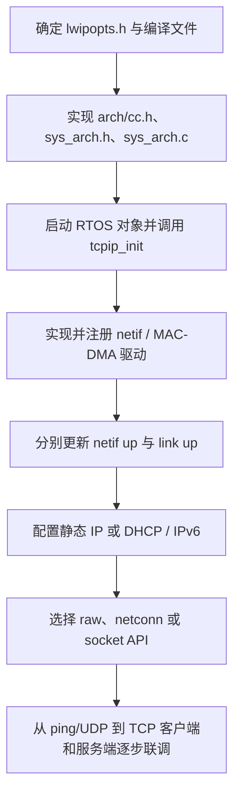

建议按这个依赖顺序排查：先确认 core 线程、邮箱、信号量及时钟工作；再确认接口状态和收发回调；接着核对 pbuf 所有权及资源池；最后检查 ARP/IP/TCP 和应用 API。常见故障包括 tcpip 线程栈或优先级不足、邮箱/pbuf pool 太小、`sys_now()` 单位错误、ISR 中调用阻塞 API、DMA 完成前释放 pbuf、`netif` 管理状态与物理链路状态混淆，以及从错误线程调用 raw API。

## 15. 建议的源码阅读顺序和跟踪练习

第一次阅读时，先按一条 TCP 数据从“发出—到达—交给应用”的路线跟代码：

1. 应用写数据：[`tcp_write()`](../src/core/tcp_out.c#L393)
2. 按窗口决定当前能发什么：[`tcp_output()`](../src/core/tcp_out.c#L1241)
3. 生成 TCP 段并交给 IP：[`tcp_output_segment()`](../src/core/tcp_out.c#L1459)
4. IP 选网卡并交给链路层：[`ip4_output()`](../src/core/ipv4/ip4.c#L1072)、[`etharp_output()`](../src/core/ipv4/etharp.c#L792)
5. 接收端按以太网类型和 IP Protocol 分发：[`ethernet_input()`](../src/netif/ethernet.c#L170)、[`ip4_input()`](../src/core/ipv4/ip4.c#L730)
6. TCP 查找连接、处理状态和序号：[`tcp_input()`](../src/core/tcp_in.c#L246)、[`tcp_process()`](../src/core/tcp_in.c#L791)、[`tcp_receive()`](../src/core/tcp_in.c#L1154)
7. 观察窗口、重传、乱序队列：[`tcp_slowtmr()`](../src/core/tcp.c#L1196)、[`tcp_rexmit_fast()`](../src/core/tcp_out.c#L1782)、[`tcp_receive()`](../src/core/tcp_in.c#L1650)
8. 对照 PPPoS 路径：[`pppos_input()`](../src/netif/ppp/pppos.c#L480) → [`ppp_input()`](../src/netif/ppp/ppp.c#L779) → [`ip4_input()`](../src/core/ipv4/ip4.c#L460)；发包反向读 [`ppp_netif_output()`](../src/netif/ppp/ppp.c#L507)

记住这条主线就容易定位：**驱动交包 → 链路层分发 → IP 分发 → TCP 按连接和序号处理 → 应用回调；发送方向则反过来，并在出链路前做选路和下一跳 MAC 解析。**

### 用纸笔先追踪三个场景

1. **ARP 缓存为空时发 TCP 包：**写出最终目的 IP、ARP 查询 IP、以太网目的 MAC。目标同网段时直接查询目标；目标异网时查询网关。
2. **丢一个 TCP 段：**标出发送段的 Seq、接收方累计 ACK、`rcv_nxt` 和 `ooseq`。补回缺口后，哪些缓存段会变成连续数据？
3. **接收窗口变成 0：**解释发送方为何暂停；应用读走数据后，哪个 API 使 `rcv_wnd` 增长？`snd_wnd` 在发送端何时更新？

继续深入 PPP 时，追踪同一个 IP 包如何在 Ethernet netif 和 PPP netif 上走不同的最后一跳；TCP/IP 核心处理应保持共用。

## 16. 其他模块地图与配置边界

理解 TCP/IP 主线后，可以按需求向 lwIP 的其他功能扩展：

| 功能 | 主要源码 | 学它时要回答的问题 |
| --- | --- | --- |
| IPv4 DHCP / AutoIP | [`dhcp.c`](../src/core/ipv4/dhcp.c)、[`autoip.c`](../src/core/ipv4/autoip.c) | 设备如何自动获得地址、网关和租约？ |
| DNS | [`dns.c`](../src/core/dns.c) | 域名查询怎样用 UDP 发出、怎样匹配事务 ID 和缓存结果？ |
| IPv4 转发、分片与重组 | [`ip4.c`](../src/core/ipv4/ip4.c)、[`ip4_frag.c`](../src/core/ipv4/ip4_frag.c) | 路由器式转发与端系统接收有什么区别？ |
| IPv6 / ND / ICMPv6 | [`ip6.c`](../src/core/ipv6/ip6.c)、[`nd6.c`](../src/core/ipv6/nd6.c)、[`icmp6.c`](../src/core/ipv6/icmp6.c) | IPv6 地址配置、邻居发现和链路层映射怎样工作？ |
| 组播 | [`igmp.c`](../src/core/ipv4/igmp.c)、[`mld6.c`](../src/core/ipv6/mld6.c) | 主机如何加入/离开 IPv4 或 IPv6 组播组？ |
| 应用示例 | [`httpd.c`](../src/apps/http/httpd.c)、[`mqtt.c`](../src/apps/mqtt/mqtt.c) | HTTP、MQTT、SNMP 等如何使用 raw API/altcp？ |
| 链路适配 | [`ethernet.c`](../src/netif/ethernet.c)、[`pppos.c`](../src/netif/ppp/pppos.c)、[`slipif.c`](../src/netif/slipif.c) | Ethernet、PPP、SLIP、6LoWPAN 如何把不同链路接到统一核心？ |

### 配置会改变哪些结论

仓库中的 [`src/include/lwip/opt.h`](../src/include/lwip/opt.h) 提供默认值和配置说明；具体产品通常通过 `lwipopts.h` 覆盖。阅读代码里的 `#if LWIP_TCP`、`#if LWIP_IPV4`、`#if PPP_SUPPORT` 等条件时，要同时确认实际构建配置。

例如，`TCP_QUEUE_OOSEQ` 决定是否缓存 TCP 乱序段，`LWIP_TCP_SACK_OUT` 决定是否发送 SACK，`NO_SYS` 决定运行模型和可用 API；因此“这份源码支持某功能”不等于“当前固件一定启用了它”。配置默认/定义见 [`opt.h`](../src/include/lwip/opt.h#L1317) 与 [`ppp_opts.h`](../src/include/netif/ppp/ppp_opts.h#L39)。PPP、PPPoS、PPPoE 还要分别检查对应开关；[PPP 配置头文件](../src/include/netif/ppp/ppp_opts.h#L39) 包含这些默认宏。

本文先帮助你掌握 lwIP 最重要的协议分层、数据路径、核心对象，以及 IP/TCP/ARP/ICMP/PPP 的实现入口。读源码时坚持按**入口 → 状态/队列 → 下一层回调 → 定时器/错误分支**跟踪；这样可以从当前主线继续覆盖 DHCP、DNS、IPv6 和应用模块，而不只记住目录名。
